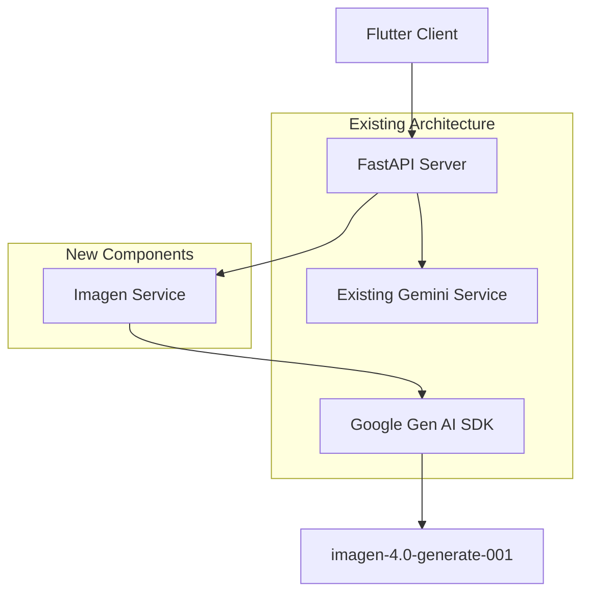

# AI メイク生成機能 - 設計書

## 概要

imagen-4.0-generate-001を使用してAIメイク画像を生成・表示する機能の技術設計書。既存アーキテクチャに最小限の変更で統合する設計方針を採用。

## アーキテクチャ設計

### 1. システム構成



### 2. レイヤー構成

#### Server Side (Python)
```
server/src/
├── api/endpoints/
│   └── makeup.py              # 新規エンドポイント追加
├── services/
│   ├── gemini_service.py      # 既存（変更なし）
│   └── imagen_service.py      # 新規作成
└── prompts/
    └── imagen_prompts.py      # 新規作成
```

#### Client Side (Flutter) 
```
lib/features/diagnosis/
├── data/
│   ├── models/
│   │   └── makeup_recommendation_model.dart  # 既存モデル拡張
│   └── datasources/
│       └── makeup_datasource.dart            # 新規エンドポイント対応
├── domain/
│   └── entities/
│       └── makeup_recommendation.dart        # 既存エンティティ拡張
└── presentation/
    └── pages/
        └── diagnosis_result_page.dart        # 画像表示機能追加
```

## 詳細設計

### 1. Server Side実装

#### 1.1 ImagenService設計

```python
# server/src/services/imagen_service.py
from typing import Optional, Dict, Any
from google import genai
from google.genai import types
from PIL import Image
from io import BytesIO
import base64
import logging

logger = logging.getLogger(__name__)

class ImagenService:
    """Imagen AI画像生成サービス"""
    
    def __init__(self, client: genai.Client):
        """
        Args:
            client: Google Gen AI SDK クライアント
        """
        self.client = client
        self.model = 'imagen-4.0-generate-001'
        
    async def generate_makeup_image(
        self, 
        base_image_bytes: bytes, 
        base_image_mime_type: str
    ) -> Optional[Dict[str, Any]]:
        """
        メイクアップ画像を生成
        
        Args:
            base_image_bytes: 元画像のバイナリデータ
            base_image_mime_type: 元画像のMIMEタイプ
            
        Returns:
            Dict containing generated image data or None if failed
        """
        try:
            # プロンプト生成
            prompt = self._create_makeup_prompt(base_image_bytes)
            
            # Imagen APIで画像生成
            result = self.client.models.generate_images(
                model=self.model,
                prompt=prompt,
                config=types.GenerateImagesConfig(
                    number_of_images=1,
                    output_mime_type="image/jpeg",
                    person_generation="ALLOW_ADULT",
                    aspect_ratio="1:1"
                )
            )
            
            if result.generated_images:
                generated_image = result.generated_images[0]
                image_bytes = generated_image.image.image_bytes
                
                return {
                    "image_data": base64.b64encode(image_bytes).decode('utf-8'),
                    "mime_type": "image/jpeg",
                    "generated_at": datetime.now().isoformat(),
                    "model_used": self.model
                }
            
            return None
            
        except Exception as e:
            logger.error(f"画像生成エラー: {e}")
            raise ImageGenerationError(f"画像生成に失敗しました: {str(e)}")
    
    def _create_makeup_prompt(self, base_image_bytes: bytes) -> str:
        """メイク生成用プロンプトを作成"""
        return """この顔写真に、自然で美しいメイクを施してください。
        
        メイクの要件:
        - アイメイク: ナチュラルなアイシャドウとアイライナー
        - リップ: 自然な色合いのリップカラー
        - チーク: 健康的な頬の色
        - 小学5年生向けアプリなので、上品で自然なメイク
        - 写真風のリアルな仕上がり
        
        元の顔の特徴を活かした、その人に似合うメイクをお願いします。"""


class ImageGenerationError(Exception):
    """画像生成エラー"""
    pass


# シングルトンパターンでサービス提供
_imagen_service: Optional[ImagenService] = None

def get_imagen_service() -> ImagenService:
    """ImagenServiceのシングルトンインスタンスを取得"""
    global _imagen_service
    if _imagen_service is None:
        from .gemini_service import get_gemini_service
        gemini_service = get_gemini_service()
        _imagen_service = ImagenService(gemini_service.client)
    return _imagen_service
```

#### 1.2 APIエンドポイント設計

```python
# server/src/api/endpoints/makeup.py (既存ファイル拡張)

# 新規エンドポイント追加
@router.post("/makeup-recommendation", response_model=AIMakeupRecommendationResponse)
async def get_ai_makeup_recommendation(
    request: Request,
    personal_color_type: str = Form(...),
    image: UploadFile = File(...)
) -> AIMakeupRecommendationResponse:
    """
    AI メイクアップ推薦エンドポイント
    
    Args:
        personal_color_type: パーソナルカラータイプ
        image: アップロードされた画像
        
    Returns:
        既存のメイク推薦 + 生成された画像
    """
    try:
        # バリデーション
        if personal_color_type not in VALID_PERSONAL_COLOR_TYPES:
            raise HTTPException(status_code=400, detail="Invalid personal color type")
        
        # 画像読み込み
        image_bytes = await image.read()
        
        # 既存のメイク推薦を取得
        makeup_recommendation = await _get_existing_makeup_recommendation(
            personal_color_type, image_bytes
        )
        
        # AI画像生成
        imagen_service = get_imagen_service()
        generated_image_data = await imagen_service.generate_makeup_image(
            image_bytes, image.content_type
        )
        
        # レスポンス構築
        response = AIMakeupRecommendationResponse(
            **makeup_recommendation.dict(),
            generated_image=generated_image_data
        )
        
        return response
        
    except ImageGenerationError as e:
        raise HTTPException(status_code=500, detail=str(e))
    except Exception as e:
        logger.error(f"AI メイク推薦エラー: {e}")
        raise HTTPException(status_code=500, detail="Internal server error")


# 新規レスポンスモデル
class GeneratedImageData(BaseModel):
    image_data: str  # Base64エンコードされた画像データ
    mime_type: str
    generated_at: str
    model_used: str


class AIMakeupRecommendationResponse(MakeupRecommendationResponse):
    """AI画像生成付きメイク推薦レスポンス"""
    generated_image: Optional[GeneratedImageData] = None
```

### 2. Client Side実装

#### 2.1 データモデル拡張

```dart
// lib/features/diagnosis/data/models/makeup_recommendation_model.dart

class GeneratedImageData {
  final String imageData; // Base64
  final String mimeType;
  final String generatedAt;
  final String modelUsed;

  const GeneratedImageData({
    required this.imageData,
    required this.mimeType,
    required this.generatedAt,
    required this.modelUsed,
  });

  factory GeneratedImageData.fromJson(Map<String, dynamic> json) {
    return GeneratedImageData(
      imageData: json['image_data'] ?? '',
      mimeType: json['mime_type'] ?? '',
      generatedAt: json['generated_at'] ?? '',
      modelUsed: json['model_used'] ?? '',
    );
  }

  Uint8List get imageBytes => base64Decode(imageData);
}

// 既存のMakeupRecommendationModelを拡張
class AIMakeupRecommendationModel extends MakeupRecommendationModel {
  final GeneratedImageData? generatedImage;

  const AIMakeupRecommendationModel({
    required super.personalColorType,
    required super.categories,
    required super.aiExplanations,
    required super.requestId,
    required super.timestamp,
    this.generatedImage,
  });

  factory AIMakeupRecommendationModel.fromJson(Map<String, dynamic> json) {
    final baseModel = MakeupRecommendationModel.fromJson(json);
    final generatedImageJson = json['generated_image'];
    
    return AIMakeupRecommendationModel(
      personalColorType: baseModel.personalColorType,
      categories: baseModel.categories,
      aiExplanations: baseModel.aiExplanations,
      requestId: baseModel.requestId,
      timestamp: baseModel.timestamp,
      generatedImage: generatedImageJson != null
          ? GeneratedImageData.fromJson(generatedImageJson)
          : null,
    );
  }
}
```

#### 2.2 データソース拡張

```dart
// lib/features/diagnosis/data/datasources/makeup_datasource.dart

abstract class MakeupDataSource {
  // 既存メソッド
  Future<MakeupRecommendationModel> getMakeupRecommendation({
    required String personalColorType,
    required File imageFile,
  });
  
  // 新規メソッド
  Future<AIMakeupRecommendationModel> getAIMakeupRecommendation({
    required String personalColorType,
    required File imageFile,
  });
}

class MakeupDataSourceImpl implements MakeupDataSource {
  // 新規メソッド実装
  @override
  Future<AIMakeupRecommendationModel> getAIMakeupRecommendation({
    required String personalColorType,
    required File imageFile,
  }) async {
    try {
      final request = http.MultipartRequest(
        'POST',
        Uri.parse('${_baseUrl}/api/v1/makeup-recommendation'), // 新規エンドポイント
      );
      
      request.fields['personal_color_type'] = personalColorType;
      request.files.add(await http.MultipartFile.fromPath(
        'image',
        imageFile.path,
      ));
      
      final streamedResponse = await request.send();
      final response = await http.Response.fromStream(streamedResponse);
      
      if (response.statusCode == 200) {
        final json = jsonDecode(response.body);
        return AIMakeupRecommendationModel.fromJson(json);
      } else {
        throw ServerException('AI メイク推薦の取得に失敗しました');
      }
    } catch (e) {
      throw ServerException('ネットワークエラーが発生しました');
    }
  }
}
```

#### 2.3 UI実装

```dart
// lib/features/diagnosis/presentation/pages/diagnosis_result_page.dart

class DiagnosisResultPage extends StatefulWidget {
  // 既存実装...
}

class _DiagnosisResultPageState extends State<DiagnosisResultPage> {
  bool _isGeneratingAIImage = false;
  AIMakeupRecommendationModel? _aiMakeupRecommendation;
  
  @override
  Widget build(BuildContext context) {
    return Scaffold(
      // 既存UI...
      body: SingleChildScrollView(
        child: Column(
          children: [
            // 既存のメイク推薦表示...
            
            // AI生成画像セクション
            _buildAIGeneratedImageSection(),
          ],
        ),
      ),
    );
  }
  
  Widget _buildAIGeneratedImageSection() {
    return Card(
      margin: const EdgeInsets.all(16),
      child: Padding(
        padding: const EdgeInsets.all(16),
        child: Column(
          crossAxisAlignment: CrossAxisAlignment.start,
          children: [
            Text(
              'AIが提案するメイク',
              style: Theme.of(context).textTheme.titleLarge,
            ),
            const SizedBox(height: 16),
            
            if (_isGeneratingAIImage)
              _buildLoadingIndicator()
            else if (_aiMakeupRecommendation?.generatedImage != null)
              _buildGeneratedImage()
            else
              _buildGenerateButton(),
          ],
        ),
      ),
    );
  }
  
  Widget _buildLoadingIndicator() {
    return const Center(
      child: Column(
        children: [
          CircularProgressIndicator(),
          SizedBox(height: 8),
          Text('AI画像を生成中...'),
        ],
      ),
    );
  }
  
  Widget _buildGeneratedImage() {
    final generatedImage = _aiMakeupRecommendation!.generatedImage!;
    return Column(
      children: [
        Container(
          height: 200,
          width: double.infinity,
          decoration: BoxDecoration(
            borderRadius: BorderRadius.circular(8),
            image: DecorationImage(
              image: MemoryImage(generatedImage.imageBytes),
              fit: BoxFit.cover,
            ),
          ),
        ),
        const SizedBox(height: 8),
        Text(
          '生成日時: ${_formatDateTime(generatedImage.generatedAt)}',
          style: Theme.of(context).textTheme.bodySmall,
        ),
      ],
    );
  }
  
  Widget _buildGenerateButton() {
    return SizedBox(
      width: double.infinity,
      child: ElevatedButton(
        onPressed: _generateAIImage,
        child: const Text('AI画像を生成する'),
      ),
    );
  }
  
  Future<void> _generateAIImage() async {
    setState(() {
      _isGeneratingAIImage = true;
    });
    
    try {
      final result = await _makeupDataSource.getAIMakeupRecommendation(
        personalColorType: widget.personalColorType,
        imageFile: widget.imageFile,
      );
      
      setState(() {
        _aiMakeupRecommendation = result;
        _isGeneratingAIImage = false;
      });
      
    } catch (e) {
      setState(() {
        _isGeneratingAIImage = false;
      });
      
      // エラーハンドリング
      _showErrorDialog(e.toString());
    }
  }
  
  void _showErrorDialog(String message) {
    showDialog(
      context: context,
      builder: (context) => AlertDialog(
        title: const Text('エラー'),
        content: Text(message),
        actions: [
          TextButton(
            onPressed: () => Navigator.pop(context),
            child: const Text('OK'),
          ),
        ],
      ),
    );
  }
  
  String _formatDateTime(String isoString) {
    final dateTime = DateTime.parse(isoString);
    return '${dateTime.year}/${dateTime.month}/${dateTime.day} ${dateTime.hour}:${dateTime.minute.toString().padLeft(2, '0')}';
  }
}
```

### 3. エラーハンドリング設計

#### 3.1 Server Side

```python
# カスタム例外定義
class ImageGenerationError(Exception):
    """画像生成関連エラー"""
    pass

class FaceDetectionError(ImageGenerationError):
    """顔検出失敗エラー"""
    pass

class APILimitError(ImageGenerationError):
    """API制限エラー"""
    pass

# エラーハンドリングロジック
async def generate_makeup_image(self, base_image_bytes: bytes, base_image_mime_type: str):
    try:
        # 画像生成処理...
        pass
    except Exception as e:
        error_message = str(e)
        
        if "face not detected" in error_message.lower():
            raise FaceDetectionError("顔が検出できませんでした。別の写真をお試しください。")
        elif "quota exceeded" in error_message.lower() or "rate limit" in error_message.lower():
            raise APILimitError("一時的にサービスが利用できません。しばらく後にお試しください。")
        else:
            raise ImageGenerationError("サーバーエラーが発生しました。しばらく後にお試しください。")
```

#### 3.2 Client Side

```dart
// エラー種別定義
abstract class MakeupFailure extends Equatable {
  const MakeupFailure();
}

class FaceDetectionFailure extends MakeupFailure {
  @override
  List<Object> get props => [];
}

class APILimitFailure extends MakeupFailure {
  @override
  List<Object> get props => [];
}

class NetworkFailure extends MakeupFailure {
  @override
  List<Object> get props => [];
}

class ServerFailure extends MakeupFailure {
  @override
  List<Object> get props => [];
}

// エラーメッセージマッピング
String mapFailureToMessage(MakeupFailure failure) {
  switch (failure.runtimeType) {
    case FaceDetectionFailure:
      return '顔が検出できませんでした。別の写真をお試しください。';
    case APILimitFailure:
      return '一時的にサービスが利用できません。しばらく後にお試しください。';
    case NetworkFailure:
      return 'インターネット接続を確認してください。';
    case ServerFailure:
    default:
      return 'サーバーエラーが発生しました。しばらく後にお試しください。';
  }
}
```

### 4. パフォーマンス最適化

#### 4.1 メモリ管理

```python
# Server Side: 画像データの即座削除
async def generate_makeup_image(self, base_image_bytes: bytes, base_image_mime_type: str):
    try:
        # 処理...
        result = self.client.models.generate_images(...)
        
        # 元画像データを即座に削除
        base_image_bytes = None
        
        return result
    finally:
        # 確実にメモリをクリアする
        import gc
        gc.collect()
```

```dart
// Client Side: 画像表示後のメモリ解放
@override
void dispose() {
  // 生成された画像データをクリア
  _aiMakeupRecommendation?.generatedImage?.imageData = null;
  super.dispose();
}
```

#### 4.2 タイムアウト設定

```python
# Server側: 適切なタイムアウト設定
class ImagenService:
    def __init__(self, client: genai.Client):
        self.client = client
        self.timeout = 120  # 2分タイムアウト
        
    async def generate_makeup_image(self, ...):
        try:
            # タイムアウト付きで実行
            result = await asyncio.wait_for(
                self._generate_image_internal(...),
                timeout=self.timeout
            )
            return result
        except asyncio.TimeoutError:
            raise ImageGenerationError("画像生成がタイムアウトしました")
```

### 5. セキュリティ設計

#### 5.1 データ保護

```python
# 画像データのログ出力を防止
import logging

class SecureFormatter(logging.Formatter):
    def format(self, record):
        # 画像データが含まれる可能性のあるフィールドをマスク
        if hasattr(record, 'args') and record.args:
            record.args = tuple(
                '[IMAGE_DATA_MASKED]' if isinstance(arg, bytes) and len(arg) > 1000
                else arg for arg in record.args
            )
        return super().format(record)
```

#### 5.2 入力検証

```python
# 画像ファイルの検証
def validate_image_input(image_bytes: bytes, mime_type: str) -> bool:
    # サイズ制限（例：10MB）
    if len(image_bytes) > 10 * 1024 * 1024:
        raise ValueError("画像サイズが大きすぎます")
    
    # MIMEタイプ検証
    allowed_types = ['image/jpeg', 'image/png', 'image/webp']
    if mime_type not in allowed_types:
        raise ValueError("サポートされていない画像形式です")
    
    return True
```

## 技術仕様

### 1. 使用ライブラリ・フレームワーク

#### Server Side
- **google-genai**: 1.33.0+ (Google Gen AI SDK)
- **Pillow**: 画像処理
- **fastapi**: 既存
- **pydantic**: 既存

#### Client Side  
- **http**: HTTP通信（既存）
- **provider**: 状態管理（既存）
- **equatable**: オブジェクト比較（既存）

### 2. API仕様

#### Request
```
POST /api/v1/makeup-recommendation
Content-Type: multipart/form-data

personal_color_type: string (spring|summer|autumn|winter)
image: file (image/jpeg|image/png|image/webp, max 10MB)
```

#### Response
```json
{
  "personal_color_type": "spring",
  "categories": { /* 既存のメイク推薦データ */ },
  "ai_explanations": { /* 既存のAI説明データ */ },
  "request_id": "uuid",
  "timestamp": "2024-01-01T12:00:00Z",
  "generated_image": {
    "image_data": "base64_encoded_image_data",
    "mime_type": "image/jpeg",
    "generated_at": "2024-01-01T12:00:30Z",
    "model_used": "imagen-4.0-generate-001"
  }
}
```

### 3. 非機能要件

#### 3.1 パフォーマンス
- **応答時間**: imagen-4.0のAPI応答時間に依存（通常30-60秒）
- **同時接続**: 既存サーバー設定に準拠
- **メモリ使用**: 画像処理時の一時的なメモリ増加を許容

#### 3.2 可用性
- **エラー率**: 95%以上の成功率を目標
- **フォールバック**: 画像生成失敗時も既存機能は動作

#### 3.3 セキュリティ
- **データ保護**: 画像データの永続化なし
- **アクセス制御**: 既存のAPI認証に準拠
- **ログ管理**: 個人情報のログ出力を禁止

## 実装順序

### Phase 1: サーバーサイド基盤
1. `ImagenService`クラス実装
2. 新規APIエンドポイント作成
3. エラーハンドリング実装
4. 単体テスト作成

### Phase 2: クライアントサイド実装
1. データモデル拡張
2. データソース拡張
3. UI実装
4. エラーハンドリング実装

### Phase 3: 統合・テスト
1. 結合テスト
2. パフォーマンステスト
3. セキュリティテスト
4. ユーザビリティテスト

### Phase 4: デプロイ・監視
1. 本番環境デプロイ
2. 監視設定
3. ログ分析
4. パフォーマンス監視

このように設計することで、既存システムへの影響を最小限に抑えながら、AI画像生成機能を安全かつ効率的に追加できます。