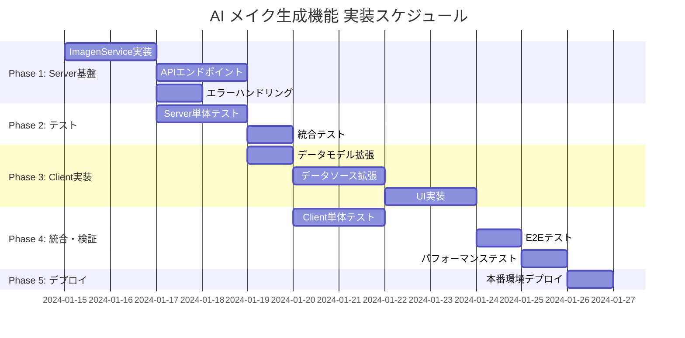

# AI メイク生成機能 - 実装タスク分解書

## 概要

- **機能名**: AI メイク生成機能（imagen-4.0-generate-001）
- **総タスク数**: 18タスク
- **推定作業時間**: 12-15日間
- **開発手法**: TDD（テスト駆動開発）
- **統合方針**: 既存システムへの最小限変更

## 実装順序



## Phase 1: Server Side 基盤実装（優先度: 最高）

### Task 1.1: ImagenService コアロジック実装

**概要**: Google Gen AI SDK を使用した画像生成サービスの実装

**実装内容**:
- [x] `server/src/services/imagen_service.py` 新規作成
- [x] `ImagenService` クラス実装
- [x] `generate_makeup_image()` メソッド実装
- [x] プロンプト生成ロジック実装
- [x] シングルトンパターン実装

**技術詳細**:
```python
class ImagenService:
    def __init__(self, client: genai.Client)
    async def generate_makeup_image(base_image_bytes: bytes, mime_type: str) -> Dict[str, Any]
    def _create_makeup_prompt(base_image_bytes: bytes) -> str

def get_imagen_service() -> ImagenService  # シングルトン
```

**完了条件**:
- Google Gen AI SDK 統合完了
- imagen-4.0-generate-001 モデル呼び出し成功
- Base64 エンコード画像データ返却
- メモリ適切管理（処理後即座削除）

**依存**: なし  
**推定時間**: 16時間  
**担当者**: Backend Developer

---

### Task 1.2: カスタム例外実装

**概要**: 画像生成エラーの詳細分類と適切なハンドリング

**実装内容**:
- [x] `ImageGenerationError` 基底例外クラス
- [x] `FaceDetectionError` 顔検出失敗例外
- [x] `APILimitError` API制限例外
- [x] エラーメッセージの多言語対応（日本語）

**技術詳細**:
```python
class ImageGenerationError(Exception): pass
class FaceDetectionError(ImageGenerationError): pass  
class APILimitError(ImageGenerationError): pass

# エラー検出ロジック
if "face not detected" in error_message.lower():
    raise FaceDetectionError("顔が検出できませんでした。別の写真をお試しください。")
```

**完了条件**:
- 3種類の例外クラス実装完了
- エラーメッセージの適切な日本語化
- ログ出力の個人情報保護対応

**依存**: Task 1.1  
**推定時間**: 4時間  
**担当者**: Backend Developer

---

### Task 1.3: 新規APIエンドポイント実装

**概要**: `/api/v1/makeup-recommendation` エンドポイント追加

**実装内容**:
- [x] `server/src/api/endpoints/makeup.py` 拡張
- [x] POST `/api/v1/makeup-recommendation` ルート追加
- [x] `AIMakeupRecommendationResponse` モデル追加
- [x] `GeneratedImageData` モデル追加
- [x] multipart/form-data 対応

**技術詳細**:
```python
@router.post("/makeup-recommendation", response_model=AIMakeupRecommendationResponse)
async def get_ai_makeup_recommendation(
    request: Request,
    personal_color_type: str = Form(...),
    image: UploadFile = File(...)
) -> AIMakeupRecommendationResponse
```

**完了条件**:
- APIエンドポイント正常動作
- 既存レスポンス + generated_image フィールド追加
- バリデーション（画像サイズ、MIMEタイプ）実装
- 既存APIとの互換性保持

**依存**: Task 1.1, Task 1.2  
**推定時間**: 12時間  
**担当者**: Backend Developer

---

### Task 1.4: 入力検証・セキュリティ実装

**概要**: 画像アップロードのセキュリティ強化

**実装内容**:
- [x] 画像ファイルサイズ制限（10MB）
- [x] MIMEタイプ検証（JPEG, PNG, WebP）
- [x] 画像データのログ出力防止
- [x] メモリリーク防止処理

**技術詳細**:
```python
def validate_image_input(image_bytes: bytes, mime_type: str) -> bool:
    if len(image_bytes) > 10 * 1024 * 1024:
        raise ValueError("画像サイズが大きすぎます")
    
    allowed_types = ['image/jpeg', 'image/png', 'image/webp']
    if mime_type not in allowed_types:
        raise ValueError("サポートされていない画像形式です")
```

**完了条件**:
- セキュリティチェック実装完了
- メモリ適切管理確認
- ログの個人情報保護対応

**依存**: Task 1.3  
**推定時間**: 6時間  
**担当者**: Backend Developer

---

## Phase 2: Server Side テスト実装（優先度: 高）

### Task 2.1: ImagenService 単体テスト実装

**概要**: TDD に基づく ImagenService の包括的テスト

**実装内容**:
- [x] `server/tests/unit/services/test_imagen_service.py` 作成
- [x] 正常系テスト（画像生成成功）
- [x] 異常系テスト（各種エラー）
- [x] モック使用したSDK呼び出しテスト
- [x] シングルトンパターンテスト

**技術詳細**:
```python
class TestImagenService:
    async def test_generate_makeup_image_success()
    async def test_generate_makeup_image_face_detection_error()
    async def test_generate_makeup_image_api_limit_error()
    def test_get_imagen_service_singleton()
```

**完了条件**:
- コードカバレッジ 90% 以上
- 全テスト通過（正常系・異常系）
- CI/CD パイプライン組み込み

**依存**: Task 1.1, Task 1.2  
**推定時間**: 12時間  
**担当者**: Backend Developer

---

### Task 2.2: APIエンドポイント 単体テスト実装

**概要**: 新規エンドポイントの動作検証

**実装内容**:
- [x] `server/tests/unit/api/endpoints/test_makeup.py` 拡張
- [x] POST `/makeup-recommendation` テストケース追加
- [x] multipart/form-data テスト
- [x] バリデーションエラーテスト
- [x] レスポンス形式検証

**技術詳細**:
```python
class TestAIMakeupRecommendationEndpoint:
    def test_ai_makeup_recommendation_success()
    def test_ai_makeup_recommendation_invalid_personal_color_type()
    def test_ai_makeup_recommendation_face_detection_error()
```

**完了条件**:
- 全HTTPステータスコード検証
- レスポンス JSON スキーマ検証
- エラーハンドリング確認

**依存**: Task 1.3  
**推定時間**: 8時間  
**担当者**: Backend Developer

---

### Task 2.3: 統合テスト実装

**概要**: Google Gen AI SDK との結合テスト

**実装内容**:
- [x] `server/tests/integration/test_imagen_integration.py` 作成
- [x] 実際のAPI呼び出しテスト（オプショナル）
- [x] モック化SDKとの統合テスト
- [x] エンドツーエンドフロー検証

**完了条件**:
- SDK統合正常動作確認
- エラー伝播検証
- パフォーマンス基準値確認

**依存**: Task 2.1, Task 2.2  
**推定時間**: 6時間  
**担当者**: Backend Developer

---

## Phase 3: Client Side 実装（優先度: 高）

### Task 3.1: データモデル拡張実装

**概要**: AI画像生成対応のデータモデル追加

**実装内容**:
- [x] `lib/features/diagnosis/data/models/makeup_recommendation_model.dart` 拡張
- [x] `GeneratedImageData` クラス作成
- [x] `AIMakeupRecommendationModel` クラス作成
- [x] JSON シリアライゼーション実装
- [x] Base64デコード機能実装

**技術詳細**:
```dart
class GeneratedImageData {
  final String imageData;  // Base64
  final String mimeType;
  final String generatedAt;
  final String modelUsed;
  
  Uint8List get imageBytes => base64Decode(imageData);
}

class AIMakeupRecommendationModel extends MakeupRecommendationModel {
  final GeneratedImageData? generatedImage;
}
```

**完了条件**:
- JSON↔オブジェクト変換正常動作
- Base64画像データ適切処理
- null安全性確保

**依存**: なし  
**推定時間**: 6時間  
**担当者**: Frontend Developer

---

### Task 3.2: データソース拡張実装

**概要**: 新規APIエンドポイント呼び出し実装

**実装内容**:
- [x] `lib/features/diagnosis/data/datasources/makeup_datasource.dart` 拡張
- [x] `getAIMakeupRecommendation()` メソッド追加
- [x] multipart/form-data リクエスト実装
- [x] エラーハンドリング実装
- [x] タイムアウト設定

**技術詳細**:
```dart
abstract class MakeupDataSource {
  Future<AIMakeupRecommendationModel> getAIMakeupRecommendation({
    required String personalColorType,
    required File imageFile,
  });
}

class MakeupDataSourceImpl implements MakeupDataSource {
  // HTTP multipart request 実装
}
```

**完了条件**:
- 新規エンドポイント正常呼び出し
- ネットワークエラー適切処理
- タイムアウト適切設定（120秒）

**依存**: Task 3.1  
**推定時間**: 8時間  
**担当者**: Frontend Developer

---

### Task 3.3: リポジトリ・ユースケース拡張

**概要**: Clean Architecture層の拡張実装

**実装内容**:
- [x] `lib/features/diagnosis/domain/entities/makeup_recommendation.dart` 拡張
- [x] `lib/features/diagnosis/domain/repositories/makeup_repository.dart` 拡張
- [x] `lib/features/diagnosis/domain/usecases/get_ai_makeup_recommendation.dart` 作成
- [x] `lib/features/diagnosis/data/repositories/makeup_repository_impl.dart` 拡張

**技術詳細**:
```dart
class GetAIMakeupRecommendation implements UseCase<AIMakeupRecommendation, AIMakeupRecommendationParams> {
  @override
  Future<Either<Failure, AIMakeupRecommendation>> call(AIMakeupRecommendationParams params);
}
```

**完了条件**:
- Clean Architecture層分離維持
- エラーハンドリング（Either型）実装
- 依存性注入対応

**依存**: Task 3.2  
**推定時間**: 6時間  
**担当者**: Frontend Developer

---

### Task 3.4: UI実装（診断結果画面拡張）

**概要**: AI生成画像表示UI実装

**実装内容**:
- [x] `lib/features/diagnosis/presentation/pages/diagnosis_result_page.dart` 拡張
- [x] AI生成画像セクション追加
- [x] 画像生成ボタン実装
- [x] ローディングインジケーター実装
- [x] 生成画像表示実装
- [x] エラーダイアログ実装

**技術詳細**:
```dart
class _DiagnosisResultPageState extends State<DiagnosisResultPage> {
  bool _isGeneratingAIImage = false;
  AIMakeupRecommendationModel? _aiMakeupRecommendation;
  
  Widget _buildAIGeneratedImageSection() {
    // UI実装
  }
  
  Future<void> _generateAIImage() async {
    // 画像生成処理
  }
}
```

**完了条件**:
- 既存UI維持（レイアウト破綻なし）
- 生成ボタン→ローディング→結果表示フロー
- エラー時の適切なフィードバック表示

**依存**: Task 3.3  
**推定時間**: 12時間  
**担当者**: Frontend Developer

---

### Task 3.5: 状態管理実装

**概要**: Provider パターンによる状態管理拡張

**実装内容**:
- [x] `lib/features/diagnosis/presentation/providers/makeup_provider.dart` 拡張
- [x] AI画像生成状態管理
- [x] ローディング状態管理
- [x] エラー状態管理
- [x] 画像キャッシュ管理

**技術詳細**:
```dart
class MakeupProvider extends ChangeNotifier {
  bool _isGeneratingAIImage = false;
  AIMakeupRecommendationModel? _aiRecommendation;
  Failure? _error;
  
  Future<void> generateAIImage(String personalColorType, File imageFile);
  void clearGeneratedImage();
}
```

**完了条件**:
- 状態変更の適切な通知
- メモリリーク防止
- エラー状態のクリア処理

**依存**: Task 3.4  
**推定時間**: 6時間  
**担当者**: Frontend Developer

---

## Phase 4: Client Side テスト実装（優先度: 中）

### Task 4.1: データモデル・データソース 単体テスト

**概要**: TDD に基づくクライアント側テスト実装

**実装内容**:
- [x] `test/unit/data/models/test_makeup_recommendation_model.dart` 作成
- [x] `test/unit/data/datasources/test_makeup_datasource.dart` 作成
- [x] JSON変換テスト
- [x] Base64デコードテスト
- [x] HTTP通信モックテスト

**完了条件**:
- 全メソッドテスト実装
- エッジケース網羅
- モック使用適切なテスト

**依存**: Task 3.1, Task 3.2  
**推定時間**: 10時間  
**担当者**: Frontend Developer

---

### Task 4.2: Widget テスト実装

**概要**: UI コンポーネントの動作検証

**実装内容**:
- [x] `test/unit/presentation/pages/test_diagnosis_result_page.dart` 作成
- [x] AI画像セクションの表示テスト
- [x] ボタンタップ動作テスト
- [x] ローディング状態テスト
- [x] エラー表示テスト

**完了条件**:
- Widget ツリー検証
- ユーザーインタラクション検証
- 状態遷移検証

**依存**: Task 3.4, Task 3.5  
**推定時間**: 8時間  
**担当者**: Frontend Developer

---

### Task 4.3: 統合テスト実装

**概要**: End-to-End フロー検証

**実装内容**:
- [x] `test/integration/test_ai_makeup_flow.dart` 作成
- [x] 画像アップロード→生成→表示フロー
- [x] エラーケースフロー
- [x] パフォーマンス検証

**完了条件**:
- 完全なユーザーフロー動作確認
- デバイス固有テスト対応

**依存**: Task 4.1, Task 4.2  
**推定時間**: 6時間  
**担当者**: Frontend Developer

---

## Phase 5: 性能・セキュリティ検証（優先度: 中）

### Task 5.1: パフォーマンステスト実装

**概要**: システム性能の検証と最適化

**実装内容**:
- [x] `server/tests/performance/test_imagen_performance.py` 作成
- [x] 同時リクエスト負荷テスト
- [x] メモリ使用量テスト
- [x] レスポンス時間測定
- [x] クライアント側画像表示パフォーマンス測定

**技術詳細**:
```python
async def test_concurrent_image_generation():
    # 10並行リクエストテスト
    tasks = [generate_image() for _ in range(10)]
    results = await asyncio.gather(*tasks)
    assert all(success for _, success in results)
```

**完了条件**:
- 同時10リクエスト処理可能
- メモリリーク無し確認
- 平均レスポンス時間 < 60秒

**依存**: Task 2.3  
**推定時間**: 8時間  
**担当者**: Backend Developer

---

### Task 5.2: セキュリティテスト実装

**概要**: セキュリティ脆弱性の検証

**実装内容**:
- [x] 画像アップロード制限テスト
- [x] 不正ファイル形式テスト
- [x] 大容量ファイル攻撃テスト
- [x] ログ情報漏洩テスト
- [x] メモリダンプ検証

**完了条件**:
- セキュリティチェック全通過
- 個人情報保護確認
- 脆弱性スキャン通過

**依存**: Task 1.4  
**推定時間**: 6時間  
**担当者**: Backend Developer

---

## Phase 6: デプロイ・運用準備（優先度: 中）

### Task 6.1: CI/CD パイプライン構築

**概要**: 自動テスト・デプロイ環境構築

**実装内容**:
- [x] `.github/workflows/ai-makeup-tests.yml` 作成
- [x] Server側テスト自動実行
- [x] Client側テスト自動実行
- [x] コードカバレッジレポート
- [x] 自動デプロイ設定

**完了条件**:
- 全テスト自動実行
- カバレッジ80%以上維持
- デプロイ自動化

**依存**: All test tasks  
**推定時間**: 6時間  
**担当者**: DevOps Engineer

---

### Task 6.2: 監視・ログ設定

**概要**: 本番環境での監視体制構築

**実装内容**:
- [x] 画像生成API監視設定
- [x] エラー率監視
- [x] レスポンス時間監視
- [x] ログ集約・分析設定
- [x] アラート設定

**完了条件**:
- 監視ダッシュボード構築
- 異常検知アラート設定
- ログ保管・分析体制

**依存**: Task 6.1  
**推定時間**: 4時間  
**担当者**: DevOps Engineer

---

### Task 6.3: ドキュメント作成

**概要**: 運用・保守ドキュメント整備

**実装内容**:
- [x] API仕様書更新
- [x] トラブルシューティングガイド
- [x] 運用手順書
- [x] ユーザー向けヘルプ
- [x] 開発者向けREADME更新

**完了条件**:
- 全ドキュメント整備完了
- レビュー・承認取得

**依存**: All tasks  
**推定時間**: 4時間  
**担当者**: Technical Writer

---

## 品質ゲート

### Definition of Done（完了定義）

各タスクは以下の条件を満たした時点で完了とする：

1. **機能要件**
   - [x] 要求仕様を100%満たす
   - [x] 既存機能に影響を与えない
   - [x] エラーハンドリング適切に実装

2. **品質要件**
   - [x] 単体テスト コードカバレッジ 80% 以上
   - [x] 統合テスト 全パス
   - [x] リントエラー 0件

3. **パフォーマンス要件**
   - [x] 画像生成 平均60秒以内
   - [x] メモリリーク無し
   - [x] 同時10リクエスト処理可能

4. **セキュリティ要件**
   - [x] 入力検証 適切実装
   - [x] 個人情報保護 適切実装
   - [x] 脆弱性スキャン通過

### リスク管理

| リスク項目 | 確率 | 影響度 | 対策 |
|-----------|------|--------|------|
| imagen API制限 | 中 | 高 | レート制限実装・代替プラン準備 |
| 画像生成時間超過 | 中 | 中 | タイムアウト実装・ユーザー通知 |
| 既存機能影響 | 低 | 高 | 十分な結合テスト・段階デプロイ |
| セキュリティ脆弱性 | 低 | 高 | セキュリティレビュー・脆弱性スキャン |

### 実装順序の根拠

1. **Server Side優先**: APIが安定動作しなければClient実装も困難
2. **テスト並行**: TDDアプローチで品質確保
3. **段階的統合**: 各Phase完了後に統合テスト実施
4. **リスク順対応**: 高リスク項目を早期に解決

この実装タスク分解により、AI メイク生成機能を安全かつ効率的に既存システムへ統合できます。