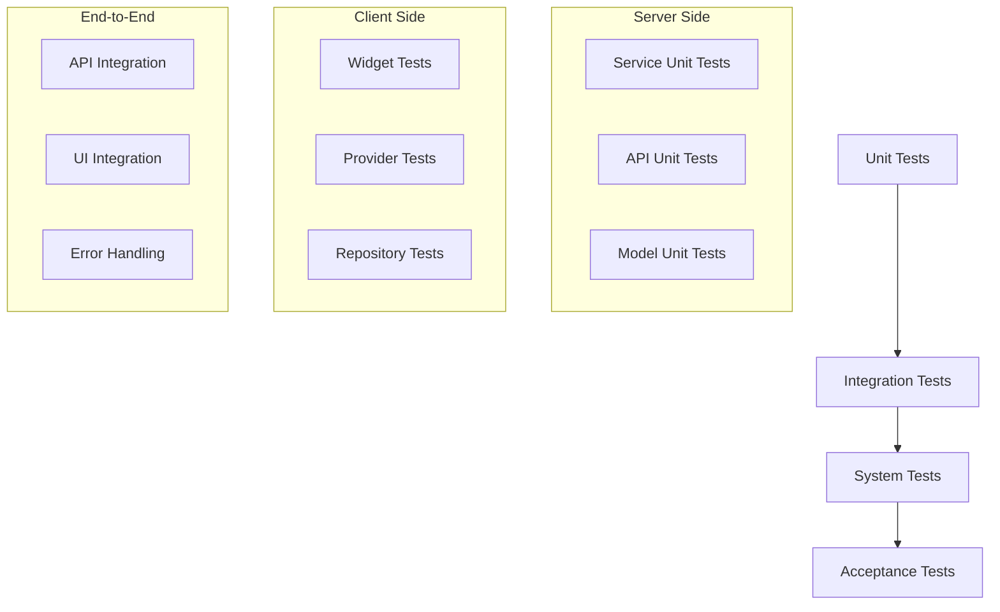

# AI メイク生成機能 - テスト設計書

## 概要

AI メイク生成機能の品質保証を目的とした包括的なテスト設計書。TDD（テスト駆動開発）アプローチを採用し、単体テスト、結合テスト、統合テストを段階的に実装する。

## テスト戦略

### 1. テストレベル



### 2. テスト方針

#### 2.1 品質目標
- **コードカバレッジ**: 80%以上
- **テスト実行時間**: 全テスト3分以内
- **成功率**: 95%以上の機能動作保証

#### 2.2 テスト環境
- **開発環境**: ローカル開発機
- **CI/CD環境**: GitHub Actions
- **ステージング環境**: 本番相当環境でのE2Eテスト

## Server Side テスト設計

### 1. Unit Tests

#### 1.1 ImagenService テスト

```python
# server/tests/unit/services/test_imagen_service.py

import pytest
from unittest.mock import AsyncMock, MagicMock, patch, call
import base64
from datetime import datetime
from io import BytesIO
from PIL import Image

from src.services.imagen_service import (
    ImagenService, 
    ImageGenerationError, 
    FaceDetectionError, 
    APILimitError,
    get_imagen_service
)


class TestImagenService:
    """ImagenService単体テスト"""
    
    @pytest.fixture
    def mock_client(self):
        """Google Gen AI SDKクライアントのモック"""
        mock_client = MagicMock()
        mock_response = MagicMock()
        mock_image = MagicMock()
        mock_image.image_bytes = b"fake_image_data"
        mock_response.generated_images = [MagicMock(image=mock_image)]
        mock_client.models.generate_images.return_value = mock_response
        return mock_client
    
    @pytest.fixture
    def imagen_service(self, mock_client):
        """ImagenServiceインスタンス"""
        return ImagenService(mock_client)
    
    @pytest.fixture
    def sample_image_bytes(self):
        """テスト用画像データ"""
        image = Image.new('RGB', (100, 100), color='red')
        buffer = BytesIO()
        image.save(buffer, format='JPEG')
        return buffer.getvalue()
    
    async def test_generate_makeup_image_success(self, imagen_service, mock_client, sample_image_bytes):
        """正常系: メイク画像生成成功"""
        # Arrange
        mime_type = "image/jpeg"
        
        # Act
        result = await imagen_service.generate_makeup_image(
            sample_image_bytes, mime_type
        )
        
        # Assert
        assert result is not None
        assert "image_data" in result
        assert "mime_type" in result
        assert result["mime_type"] == "image/jpeg"
        assert "generated_at" in result
        assert "model_used" in result
        assert result["model_used"] == "imagen-4.0-generate-001"
        
        # APIが正しいパラメータで呼ばれたか確認
        mock_client.models.generate_images.assert_called_once()
        call_args = mock_client.models.generate_images.call_args
        assert call_args[1]["model"] == "imagen-4.0-generate-001"
        assert call_args[1]["config"].number_of_images == 1
        assert call_args[1]["config"].output_mime_type == "image/jpeg"
        assert call_args[1]["config"].person_generation == "ALLOW_ADULT"
        assert call_args[1]["config"].aspect_ratio == "1:1"
    
    async def test_generate_makeup_image_no_images_generated(self, imagen_service, mock_client, sample_image_bytes):
        """異常系: 画像生成なし"""
        # Arrange
        mock_client.models.generate_images.return_value.generated_images = []
        
        # Act
        result = await imagen_service.generate_makeup_image(
            sample_image_bytes, "image/jpeg"
        )
        
        # Assert
        assert result is None
    
    async def test_generate_makeup_image_face_detection_error(self, imagen_service, mock_client, sample_image_bytes):
        """異常系: 顔検出エラー"""
        # Arrange
        mock_client.models.generate_images.side_effect = Exception("Face not detected in image")
        
        # Act & Assert
        with pytest.raises(FaceDetectionError) as exc_info:
            await imagen_service.generate_makeup_image(sample_image_bytes, "image/jpeg")
        assert "顔が検出できませんでした" in str(exc_info.value)
    
    async def test_generate_makeup_image_api_limit_error(self, imagen_service, mock_client, sample_image_bytes):
        """異常系: API制限エラー"""
        # Arrange
        mock_client.models.generate_images.side_effect = Exception("Quota exceeded")
        
        # Act & Assert
        with pytest.raises(APILimitError) as exc_info:
            await imagen_service.generate_makeup_image(sample_image_bytes, "image/jpeg")
        assert "一時的にサービスが利用できません" in str(exc_info.value)
    
    async def test_generate_makeup_image_general_error(self, imagen_service, mock_client, sample_image_bytes):
        """異常系: 一般的なエラー"""
        # Arrange
        mock_client.models.generate_images.side_effect = Exception("Unknown error")
        
        # Act & Assert
        with pytest.raises(ImageGenerationError) as exc_info:
            await imagen_service.generate_makeup_image(sample_image_bytes, "image/jpeg")
        assert "サーバーエラーが発生しました" in str(exc_info.value)
    
    def test_create_makeup_prompt(self, imagen_service, sample_image_bytes):
        """プロンプト生成テスト"""
        # Act
        prompt = imagen_service._create_makeup_prompt(sample_image_bytes)
        
        # Assert
        assert "メイク" in prompt
        assert "アイメイク" in prompt
        assert "リップ" in prompt
        assert "チーク" in prompt
        assert "小学5年生" in prompt
        assert "自然" in prompt
    
    @patch('src.services.imagen_service.get_gemini_service')
    def test_get_imagen_service_singleton(self, mock_get_gemini_service):
        """シングルトンパターンテスト"""
        # Arrange
        mock_gemini_service = MagicMock()
        mock_gemini_service.client = MagicMock()
        mock_get_gemini_service.return_value = mock_gemini_service
        
        # Act
        service1 = get_imagen_service()
        service2 = get_imagen_service()
        
        # Assert
        assert service1 is service2
        assert isinstance(service1, ImagenService)
```

#### 1.2 API エンドポイント テスト

```python
# server/tests/unit/api/endpoints/test_makeup.py (拡張)

import pytest
from fastapi.testclient import TestClient
from fastapi import UploadFile
from unittest.mock import patch, MagicMock, AsyncMock
import json
from io import BytesIO
from PIL import Image

from src.api.main import app
from src.services.imagen_service import ImageGenerationError, FaceDetectionError, APILimitError


class TestAIMakeupRecommendationEndpoint:
    """AI メイク推薦エンドポイント単体テスト"""
    
    @pytest.fixture
    def client(self):
        """FastAPI テストクライアント"""
        return TestClient(app)
    
    @pytest.fixture
    def sample_image_file(self):
        """テスト用画像ファイル"""
        image = Image.new('RGB', (100, 100), color='blue')
        buffer = BytesIO()
        image.save(buffer, format='JPEG')
        buffer.seek(0)
        return ("test.jpg", buffer, "image/jpeg")
    
    @pytest.fixture
    def mock_services(self):
        """サービスのモック"""
        with patch('src.api.endpoints.makeup.get_imagen_service') as mock_imagen_service, \
             patch('src.api.endpoints.makeup._get_existing_makeup_recommendation') as mock_existing:
            
            # Existing makeup recommendation mock
            mock_existing.return_value = MagicMock()
            mock_existing.return_value.dict.return_value = {
                "personal_color_type": "spring",
                "categories": {},
                "ai_explanations": {},
                "request_id": "test-id",
                "timestamp": "2024-01-01T00:00:00Z"
            }
            
            # Imagen service mock
            mock_imagen_instance = AsyncMock()
            mock_imagen_instance.generate_makeup_image.return_value = {
                "image_data": "base64encodeddata",
                "mime_type": "image/jpeg",
                "generated_at": "2024-01-01T00:00:30Z",
                "model_used": "imagen-4.0-generate-001"
            }
            mock_imagen_service.return_value = mock_imagen_instance
            
            yield {
                "imagen_service": mock_imagen_instance,
                "existing_recommendation": mock_existing
            }
    
    def test_ai_makeup_recommendation_success(self, client, sample_image_file, mock_services):
        """正常系: AI メイク推薦成功"""
        # Arrange
        filename, file_data, mime_type = sample_image_file
        
        # Act
        response = client.post(
            "/api/v1/makeup-recommendation",
            data={"personal_color_type": "spring"},
            files={"image": (filename, file_data, mime_type)}
        )
        
        # Assert
        assert response.status_code == 200
        data = response.json()
        
        assert data["personal_color_type"] == "spring"
        assert "categories" in data
        assert "ai_explanations" in data
        assert "request_id" in data
        assert "timestamp" in data
        assert "generated_image" in data
        
        generated_image = data["generated_image"]
        assert generated_image["image_data"] == "base64encodeddata"
        assert generated_image["mime_type"] == "image/jpeg"
        assert generated_image["model_used"] == "imagen-4.0-generate-001"
    
    def test_ai_makeup_recommendation_invalid_personal_color_type(self, client, sample_image_file):
        """異常系: 無効なパーソナルカラータイプ"""
        # Arrange
        filename, file_data, mime_type = sample_image_file
        
        # Act
        response = client.post(
            "/api/v1/makeup-recommendation",
            data={"personal_color_type": "invalid"},
            files={"image": (filename, file_data, mime_type)}
        )
        
        # Assert
        assert response.status_code == 400
        assert "Invalid personal color type" in response.json()["detail"]
    
    def test_ai_makeup_recommendation_face_detection_error(self, client, sample_image_file, mock_services):
        """異常系: 顔検出エラー"""
        # Arrange
        filename, file_data, mime_type = sample_image_file
        mock_services["imagen_service"].generate_makeup_image.side_effect = FaceDetectionError("顔が検出できませんでした")
        
        # Act
        response = client.post(
            "/api/v1/makeup-recommendation",
            data={"personal_color_type": "spring"},
            files={"image": (filename, file_data, mime_type)}
        )
        
        # Assert
        assert response.status_code == 500
        assert "顔が検出できませんでした" in response.json()["detail"]
    
    def test_ai_makeup_recommendation_api_limit_error(self, client, sample_image_file, mock_services):
        """異常系: API制限エラー"""
        # Arrange
        filename, file_data, mime_type = sample_image_file
        mock_services["imagen_service"].generate_makeup_image.side_effect = APILimitError("一時的にサービスが利用できません")
        
        # Act
        response = client.post(
            "/api/v1/makeup-recommendation",
            data={"personal_color_type": "spring"},
            files={"image": (filename, file_data, mime_type)}
        )
        
        # Assert
        assert response.status_code == 500
        assert "一時的にサービスが利用できません" in response.json()["detail"]
    
    def test_ai_makeup_recommendation_missing_image(self, client):
        """異常系: 画像ファイル未指定"""
        # Act
        response = client.post(
            "/api/v1/makeup-recommendation",
            data={"personal_color_type": "spring"}
        )
        
        # Assert
        assert response.status_code == 422  # Validation error
```

### 2. Integration Tests

#### 2.1 Google Gen AI SDK統合テスト

```python
# server/tests/integration/test_imagen_integration.py

import pytest
import asyncio
from unittest.mock import patch, MagicMock
from io import BytesIO
from PIL import Image
import os

from src.services.imagen_service import get_imagen_service, ImageGenerationError


class TestImagenIntegration:
    """Imagen API統合テスト"""
    
    @pytest.fixture
    def sample_face_image_bytes(self):
        """顔が含まれるテスト画像を生成"""
        # 実際のテストでは顔が含まれるサンプル画像を使用
        image = Image.new('RGB', (256, 256), color='white')
        # 簡単な顔のような図形を描画
        # 実際の実装では適切なサンプル顔画像を使用
        buffer = BytesIO()
        image.save(buffer, format='JPEG')
        return buffer.getvalue()
    
    @pytest.mark.integration
    @pytest.mark.skipif(
        not os.getenv('RUN_INTEGRATION_TESTS'),
        reason="Integration tests require RUN_INTEGRATION_TESTS=1"
    )
    async def test_real_imagen_api_integration(self, sample_face_image_bytes):
        """実際のImagen APIとの統合テスト（オプショナル）"""
        # この テストは実際のAPIを呼び出すため、通常はスキップ
        # CI/CDパイプラインでは環境変数で制御
        
        imagen_service = get_imagen_service()
        
        try:
            result = await imagen_service.generate_makeup_image(
                sample_face_image_bytes, "image/jpeg"
            )
            
            # APIレスポンスの検証
            assert result is not None
            assert "image_data" in result
            assert len(result["image_data"]) > 0
            assert result["mime_type"] == "image/jpeg"
            assert result["model_used"] == "imagen-4.0-generate-001"
            
        except Exception as e:
            # ネットワークエラーやAPI制限の場合はスキップ
            pytest.skip(f"Integration test skipped due to: {e}")
    
    @pytest.mark.integration
    async def test_imagen_service_with_mock_sdk(self, sample_face_image_bytes):
        """モック化されたSDKとの統合テスト"""
        with patch('src.services.imagen_service.genai') as mock_genai:
            # SDKレスポンスをモック
            mock_client = MagicMock()
            mock_response = MagicMock()
            mock_image = MagicMock()
            mock_image.image_bytes = b"mocked_image_data"
            mock_response.generated_images = [MagicMock(image=mock_image)]
            mock_client.models.generate_images.return_value = mock_response
            mock_genai.Client.return_value = mock_client
            
            # 設定をモック
            with patch('src.services.imagen_service.get_settings') as mock_settings:
                mock_settings_obj = MagicMock()
                mock_settings_obj.google_cloud_project = "test-project"
                mock_settings_obj.vertex_ai_location = "us-central1"
                mock_settings.return_value = mock_settings_obj
                
                imagen_service = get_imagen_service()
                result = await imagen_service.generate_makeup_image(
                    sample_face_image_bytes, "image/jpeg"
                )
                
                # 統合結果の検証
                assert result is not None
                assert "image_data" in result
                mock_client.models.generate_images.assert_called_once()
```

## Client Side テスト設計

### 1. Unit Tests

#### 1.1 データモデル テスト

```dart
// client/personal_color_app/test/unit/data/models/test_makeup_recommendation_model.dart

import 'dart:convert';
import 'dart:typed_data';
import 'package:flutter_test/flutter_test.dart';
import 'package:personal_color_app/features/diagnosis/data/models/makeup_recommendation_model.dart';

void main() {
  group('GeneratedImageData', () {
    const sampleImageData = 'iVBORw0KGgoAAAANSUhEUgAAAAEAAAABCAYAAAAfFcSJAAAADUlEQVR42mNk+M9QDwADhgGAWjR9awAAAABJRU5ErkJggg==';
    
    test('should create GeneratedImageData from JSON correctly', () {
      // Arrange
      final json = {
        'image_data': sampleImageData,
        'mime_type': 'image/jpeg',
        'generated_at': '2024-01-01T12:00:00Z',
        'model_used': 'imagen-4.0-generate-001',
      };
      
      // Act
      final result = GeneratedImageData.fromJson(json);
      
      // Assert
      expect(result.imageData, sampleImageData);
      expect(result.mimeType, 'image/jpeg');
      expect(result.generatedAt, '2024-01-01T12:00:00Z');
      expect(result.modelUsed, 'imagen-4.0-generate-001');
    });
    
    test('should convert image data to bytes correctly', () {
      // Arrange
      final imageData = GeneratedImageData(
        imageData: sampleImageData,
        mimeType: 'image/jpeg',
        generatedAt: '2024-01-01T12:00:00Z',
        modelUsed: 'imagen-4.0-generate-001',
      );
      
      // Act
      final bytes = imageData.imageBytes;
      
      // Assert
      expect(bytes, isA<Uint8List>());
      expect(bytes.isNotEmpty, true);
    });
  });
  
  group('AIMakeupRecommendationModel', () {
    test('should create AIMakeupRecommendationModel from JSON correctly', () {
      // Arrange
      final json = {
        'personal_color_type': 'spring',
        'categories': <String, dynamic>{},
        'ai_explanations': <String, dynamic>{},
        'request_id': 'test-123',
        'timestamp': '2024-01-01T12:00:00Z',
        'generated_image': {
          'image_data': 'base64data',
          'mime_type': 'image/jpeg',
          'generated_at': '2024-01-01T12:00:30Z',
          'model_used': 'imagen-4.0-generate-001',
        },
      };
      
      // Act
      final result = AIMakeupRecommendationModel.fromJson(json);
      
      // Assert
      expect(result.personalColorType, 'spring');
      expect(result.requestId, 'test-123');
      expect(result.generatedImage, isNotNull);
      expect(result.generatedImage!.imageData, 'base64data');
      expect(result.generatedImage!.modelUsed, 'imagen-4.0-generate-001');
    });
    
    test('should handle null generated_image correctly', () {
      // Arrange
      final json = {
        'personal_color_type': 'spring',
        'categories': <String, dynamic>{},
        'ai_explanations': <String, dynamic>{},
        'request_id': 'test-123',
        'timestamp': '2024-01-01T12:00:00Z',
        'generated_image': null,
      };
      
      // Act
      final result = AIMakeupRecommendationModel.fromJson(json);
      
      // Assert
      expect(result.personalColorType, 'spring');
      expect(result.generatedImage, isNull);
    });
  });
}
```

#### 1.2 データソース テスト

```dart
// client/personal_color_app/test/unit/data/datasources/test_makeup_datasource.dart

import 'dart:io';
import 'package:flutter_test/flutter_test.dart';
import 'package:mockito/mockito.dart';
import 'package:mockito/annotations.dart';
import 'package:http/http.dart' as http;
import 'package:personal_color_app/features/diagnosis/data/datasources/makeup_datasource.dart';
import 'package:personal_color_app/core/errors/exceptions.dart';

import 'test_makeup_datasource.mocks.dart';

@GenerateMocks([http.Client])
void main() {
  late MakeupDataSourceImpl dataSource;
  late MockClient mockClient;
  late File mockImageFile;

  setUp(() {
    mockClient = MockClient();
    dataSource = MakeupDataSourceImpl(client: mockClient, baseUrl: 'https://api.test.com');
    
    // Mock image file
    mockImageFile = File('test_assets/test_image.jpg');
  });

  group('getAIMakeupRecommendation', () {
    test('should return AIMakeupRecommendationModel when successful', () async {
      // Arrange
      final responseJson = '''
      {
        "personal_color_type": "spring",
        "categories": {},
        "ai_explanations": {},
        "request_id": "test-123",
        "timestamp": "2024-01-01T12:00:00Z",
        "generated_image": {
          "image_data": "base64data",
          "mime_type": "image/jpeg",
          "generated_at": "2024-01-01T12:00:30Z",
          "model_used": "imagen-4.0-generate-001"
        }
      }
      ''';
      
      when(mockClient.send(any))
          .thenAnswer((_) async => http.StreamedResponse(
                Stream.fromIterable([utf8.encode(responseJson)]),
                200,
              ));
      
      // Act
      final result = await dataSource.getAIMakeupRecommendation(
        personalColorType: 'spring',
        imageFile: mockImageFile,
      );
      
      // Assert
      expect(result, isA<AIMakeupRecommendationModel>());
      expect(result.personalColorType, 'spring');
      expect(result.generatedImage, isNotNull);
      expect(result.generatedImage!.imageData, 'base64data');
    });
    
    test('should throw ServerException when status code is not 200', () async {
      // Arrange
      when(mockClient.send(any))
          .thenAnswer((_) async => http.StreamedResponse(
                Stream.fromIterable([utf8.encode('{"error": "Internal error"}')]),
                500,
              ));
      
      // Act & Assert
      expect(
        () => dataSource.getAIMakeupRecommendation(
          personalColorType: 'spring',
          imageFile: mockImageFile,
        ),
        throwsA(isA<ServerException>()),
      );
    });
    
    test('should throw ServerException when network error occurs', () async {
      // Arrange
      when(mockClient.send(any))
          .thenThrow(const SocketException('No internet connection'));
      
      // Act & Assert
      expect(
        () => dataSource.getAIMakeupRecommendation(
          personalColorType: 'spring',
          imageFile: mockImageFile,
        ),
        throwsA(isA<ServerException>()),
      );
    });
  });
}
```

#### 1.3 Widget テスト

```dart
// client/personal_color_app/test/unit/presentation/pages/test_diagnosis_result_page.dart

import 'package:flutter/material.dart';
import 'package:flutter_test/flutter_test.dart';
import 'package:mockito/mockito.dart';
import 'package:mockito/annotations.dart';
import 'package:provider/provider.dart';
import 'package:personal_color_app/features/diagnosis/presentation/pages/diagnosis_result_page.dart';
import 'package:personal_color_app/features/diagnosis/data/datasources/makeup_datasource.dart';

import 'test_diagnosis_result_page.mocks.dart';

@GenerateMocks([MakeupDataSource])
void main() {
  late MockMakeupDataSource mockDataSource;

  setUp(() {
    mockDataSource = MockMakeupDataSource();
  });

  Widget createWidgetUnderTest() {
    return MaterialApp(
      home: Provider<MakeupDataSource>.value(
        value: mockDataSource,
        child: DiagnosisResultPage(
          personalColorType: 'spring',
          imageFile: File('test_assets/test_image.jpg'),
        ),
      ),
    );
  }

  group('DiagnosisResultPage AI Image Section', () {
    testWidgets('should show generate button initially', (tester) async {
      // Act
      await tester.pumpWidget(createWidgetUnderTest());
      
      // Assert
      expect(find.text('AI画像を生成する'), findsOneWidget);
      expect(find.byType(CircularProgressIndicator), findsNothing);
    });
    
    testWidgets('should show loading indicator when generating', (tester) async {
      // Arrange
      when(mockDataSource.getAIMakeupRecommendation(
        personalColorType: anyNamed('personalColorType'),
        imageFile: anyNamed('imageFile'),
      )).thenAnswer((_) => Future.delayed(
        const Duration(seconds: 2),
        () => mockAIMakeupRecommendation,
      ));
      
      // Act
      await tester.pumpWidget(createWidgetUnderTest());
      await tester.tap(find.text('AI画像を生成する'));
      await tester.pump();
      
      // Assert
      expect(find.byType(CircularProgressIndicator), findsOneWidget);
      expect(find.text('AI画像を生成中...'), findsOneWidget);
    });
    
    testWidgets('should show generated image when successful', (tester) async {
      // Arrange
      final mockRecommendation = AIMakeupRecommendationModel(
        personalColorType: 'spring',
        categories: {},
        aiExplanations: {},
        requestId: 'test-123',
        timestamp: '2024-01-01T12:00:00Z',
        generatedImage: GeneratedImageData(
          imageData: 'base64data',
          mimeType: 'image/jpeg',
          generatedAt: '2024-01-01T12:00:30Z',
          modelUsed: 'imagen-4.0-generate-001',
        ),
      );
      
      when(mockDataSource.getAIMakeupRecommendation(
        personalColorType: anyNamed('personalColorType'),
        imageFile: anyNamed('imageFile'),
      )).thenAnswer((_) async => mockRecommendation);
      
      // Act
      await tester.pumpWidget(createWidgetUnderTest());
      await tester.tap(find.text('AI画像を生成する'));
      await tester.pumpAndSettle();
      
      // Assert
      expect(find.byType(Image), findsOneWidget);
      expect(find.textContaining('生成日時:'), findsOneWidget);
    });
    
    testWidgets('should show error dialog when generation fails', (tester) async {
      // Arrange
      when(mockDataSource.getAIMakeupRecommendation(
        personalColorType: anyNamed('personalColorType'),
        imageFile: anyNamed('imageFile'),
      )).thenThrow(const ServerException('API error'));
      
      // Act
      await tester.pumpWidget(createWidgetUnderTest());
      await tester.tap(find.text('AI画像を生成する'));
      await tester.pumpAndSettle();
      
      // Assert
      expect(find.byType(AlertDialog), findsOneWidget);
      expect(find.text('エラー'), findsOneWidget);
    });
  });
}
```

### 2. Integration Tests

#### 2.1 End-to-End テスト

```dart
// client/personal_color_app/test/integration/test_ai_makeup_flow.dart

import 'package:flutter/material.dart';
import 'package:flutter_test/flutter_test.dart';
import 'package:integration_test/integration_test.dart';
import 'package:personal_color_app/main.dart' as app;
import 'package:personal_color_app/core/di/injection_container.dart' as di;

void main() {
  IntegrationTestWidgetsFlutterBinding.ensureInitialized();

  group('AI Makeup Generation E2E Tests', () {
    setUpAll(() async {
      await di.init();
    });

    testWidgets('Complete AI makeup generation flow', (tester) async {
      // Start the app
      app.main();
      await tester.pumpAndSettle();

      // Navigate to camera screen
      await tester.tap(find.text('カメラで撮影'));
      await tester.pumpAndSettle();

      // Simulate camera capture (mocked)
      // In actual E2E test, this would involve camera plugin testing
      
      // Navigate to diagnosis result
      // This would involve the actual diagnosis flow
      
      // Test AI image generation
      expect(find.text('AIが提案するメイク'), findsOneWidget);
      
      await tester.tap(find.text('AI画像を生成する'));
      await tester.pumpAndSettle();
      
      // Wait for generation to complete (with timeout)
      await tester.pumpAndSettle(const Duration(seconds: 60));
      
      // Verify generated image is displayed
      expect(find.byType(Image), findsWidgets);
      expect(find.textContaining('生成日時:'), findsOneWidget);
    });
  });
}
```

## パフォーマンステスト

### 1. 負荷テスト

```python
# server/tests/performance/test_imagen_performance.py

import asyncio
import time
from concurrent.futures import ThreadPoolExecutor
import pytest
from unittest.mock import patch, MagicMock

from src.services.imagen_service import get_imagen_service


class TestImagenPerformance:
    """Imagen API パフォーマンステスト"""
    
    @pytest.mark.performance
    @patch('src.services.imagen_service.genai')
    async def test_concurrent_image_generation(self, mock_genai):
        """同時リクエスト処理性能テスト"""
        # Arrange
        mock_client = MagicMock()
        mock_response = MagicMock()
        mock_image = MagicMock()
        mock_image.image_bytes = b"test_image_data"
        mock_response.generated_images = [MagicMock(image=mock_image)]
        mock_client.models.generate_images.return_value = mock_response
        mock_genai.Client.return_value = mock_client
        
        imagen_service = get_imagen_service()
        sample_image = b"sample_image_data"
        
        async def generate_image():
            start_time = time.time()
            result = await imagen_service.generate_makeup_image(sample_image, "image/jpeg")
            end_time = time.time()
            return end_time - start_time, result is not None
        
        # Act - 10並行リクエスト
        start_time = time.time()
        tasks = [generate_image() for _ in range(10)]
        results = await asyncio.gather(*tasks)
        total_time = time.time() - start_time
        
        # Assert
        assert len(results) == 10
        assert all(success for _, success in results)
        assert total_time < 5.0  # 5秒以内で完了
        
        # 個別レスポンス時間の確認
        response_times = [duration for duration, _ in results]
        avg_response_time = sum(response_times) / len(response_times)
        assert avg_response_time < 1.0  # 平均1秒以内（モック環境）
    
    @pytest.mark.performance
    async def test_memory_usage_during_generation(self):
        """メモリ使用量テスト"""
        import psutil
        import os
        
        process = psutil.Process(os.getpid())
        initial_memory = process.memory_info().rss
        
        # 大きな画像データでのテスト
        large_image_data = b"x" * (5 * 1024 * 1024)  # 5MB
        
        with patch('src.services.imagen_service.genai') as mock_genai:
            mock_client = MagicMock()
            mock_response = MagicMock()
            mock_image = MagicMock()
            mock_image.image_bytes = b"result_image_data"
            mock_response.generated_images = [MagicMock(image=mock_image)]
            mock_client.models.generate_images.return_value = mock_response
            mock_genai.Client.return_value = mock_client
            
            imagen_service = get_imagen_service()
            
            # 複数回実行
            for _ in range(5):
                await imagen_service.generate_makeup_image(large_image_data, "image/jpeg")
            
            final_memory = process.memory_info().rss
            memory_increase = final_memory - initial_memory
            
            # メモリリーク検証（50MB以下の増加を許容）
            assert memory_increase < 50 * 1024 * 1024
```

## CI/CD テスト設定

### 1. GitHub Actions テスト設定

```yaml
# .github/workflows/ai-makeup-tests.yml

name: AI Makeup Feature Tests

on:
  push:
    paths:
      - 'server/src/services/imagen_service.py'
      - 'server/src/api/endpoints/makeup.py'
      - 'client/personal_color_app/lib/features/diagnosis/**'
      - 'specifications/ai-makeup/**'
  pull_request:
    paths:
      - 'server/src/services/imagen_service.py'
      - 'server/src/api/endpoints/makeup.py'
      - 'client/personal_color_app/lib/features/diagnosis/**'

jobs:
  server-tests:
    runs-on: ubuntu-latest
    steps:
      - uses: actions/checkout@v4
      
      - name: Set up Python
        uses: actions/setup-python@v4
        with:
          python-version: '3.10'
          
      - name: Install dependencies
        run: |
          cd server
          python -m pip install --upgrade pip
          pip install -r requirements.txt
          pip install -r requirements-dev.txt
          
      - name: Run unit tests
        run: |
          cd server
          pytest tests/unit/services/test_imagen_service.py -v --cov=src.services.imagen_service
          pytest tests/unit/api/endpoints/test_makeup.py -v --cov=src.api.endpoints.makeup
          
      - name: Run integration tests
        run: |
          cd server
          pytest tests/integration/test_imagen_integration.py -v -m "not performance"
          
      - name: Upload coverage reports
        uses: codecov/codecov-action@v3
        with:
          file: server/coverage.xml

  client-tests:
    runs-on: ubuntu-latest
    steps:
      - uses: actions/checkout@v4
      
      - name: Set up Flutter
        uses: subosito/flutter-action@v2
        with:
          flutter-version: '3.13.x'
          
      - name: Install dependencies
        run: |
          cd client/personal_color_app
          flutter pub get
          
      - name: Run unit tests
        run: |
          cd client/personal_color_app
          flutter test test/unit/data/models/test_makeup_recommendation_model.dart
          flutter test test/unit/data/datasources/test_makeup_datasource.dart
          flutter test test/unit/presentation/pages/test_diagnosis_result_page.dart
          
      - name: Run widget tests
        run: |
          cd client/personal_color_app
          flutter test --coverage
          
      - name: Upload coverage reports
        uses: codecov/codecov-action@v3
        with:
          file: client/personal_color_app/coverage/lcov.info
```

## テスト実行スケジュール

### 1. 開発フェーズ
- **TDD実践**: 実装前にテストを作成
- **継続的テスト**: コード変更時の自動テスト実行
- **デイリーレビュー**: テスト結果とカバレッジの確認

### 2. 統合フェーズ
- **結合テスト**: 週2回実行
- **パフォーマンステスト**: 週1回実行
- **E2Eテスト**: マイルストーン毎に実行

### 3. リリースフェーズ
- **全テストスイート**: リリース前に実行
- **本番環境テスト**: デプロイ後の動作確認
- **監視テスト**: リリース後1週間の集中監視

この包括的なテスト設計により、AI メイク生成機能の品質を保証し、安定したリリースを実現します。