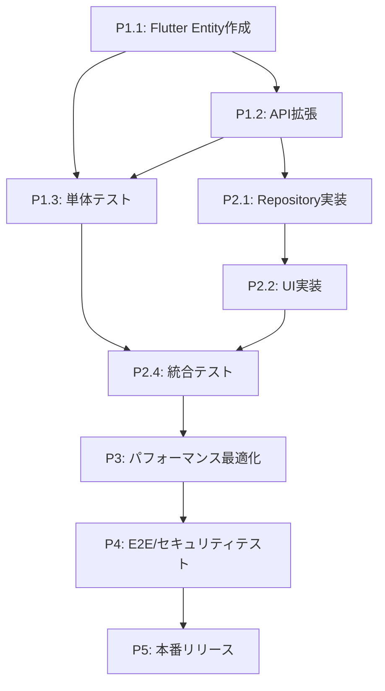

# 全年齢対応パーソナルカラー診断 - 実装タスク分解

## 概要

年齢・性別推定機能を含む全年齢対応パーソナルカラー診断システムの実装タスクを段階的に分解し、実装順序とマイルストーンを定義する。

## 実装フェーズ

### Phase 1: データ構造・基盤整備 ✅ **完了** (1-2週間)

#### P1.1 Flutter Client - ドメイン層拡張 ✅

**P1.1.1 新規エンティティ作成** ✅
- [x] `AgeGroup` enum作成 (`lib/features/diagnosis/domain/entities/age_group.dart`)
  - 5つの年代区分定義 (child, student, adult, middleAge, senior)
  - `displayName`, `apiValue` extension追加
  - `fromApiValue` static method追加
- [x] `Gender` enum作成 (`lib/features/diagnosis/domain/entities/gender.dart`)
  - 3つの性別区分定義 (male, female, unknown)
  - `displayName`, `apiValue` extension追加
  - `fromApiValue` static method追加
- [x] `PersonAnalysis` entity作成 (`lib/features/diagnosis/domain/entities/person_analysis.dart`)
  - `ageGroup`, `gender`, `confidence` フィールド
  - `fromJson`, `toJson` メソッド
  - Equatable実装

**P1.1.2 既存エンティティ拡張** ✅
- [x] `DiagnosisResult` entity拡張 (`lib/features/diagnosis/domain/entities/diagnosis_result.dart`)
  - `personAnalysis` フィールド追加 (Optional)
  - `hasPersonAnalysis` getter追加
  - `isAdaptiveContent` getter追加
  - `fromJson`, `toJson` 更新

**P1.1.3 Repository Interface拡張** ✅
- [x] `DiagnosisRepository` interface拡張 (`lib/features/diagnosis/domain/repositories/diagnosis_repository.dart`)
  - `diagnosePersonalColorEnhanced` メソッド追加

**P1.1.4 UseCase作成** ✅
- [x] `DiagnosePersonalColorEnhanced` usecase作成 (`lib/features/diagnosis/domain/usecases/diagnose_personal_color_enhanced.dart`)
  - `DiagnosePersonalColorParams` パラメータクラス作成
  - metadata対応

#### P1.2 Python Server - データ構造・API拡張

**P1.2.1 プロンプトエンジン拡張**
- [ ] `PersonalColorPrompt` class拡張 (`src/prompts/personal_color_analysis.py`)
  - `create_enhanced_analysis_prompt` メソッド追加（実装済み）
  - `get_adaptive_explanation_template` メソッド追加（未実装）
  - `validate_enhanced_response_format` メソッド追加（実装済み）
  - 年代・性別別テンプレート定義（未実装）

**P1.2.2 APIエンドポイント作成**
- [x] 新API endpoint作成 (`src/api/endpoints/diagnosis.py`)
  - `/diagnose-enhanced` POST endpoint追加（実装済み）
  - `EnhancedDiagnosisResponse` レスポンスモデル作成（実装済み）
  - `PersonAnalysisResponse` サブモデル作成（実装済み）
  - リクエスト/レスポンス検証（実装済み）
  - 備考: 既存の`/diagnose`（非拡張）も`GeminiService._parse_basic_response`を使用するように統一（パーサをサービス側に集約）

**P1.2.3 GeminiService拡張**
- [x] `GeminiService` class拡張 (`src/services/gemini_service.py`)
  - `analyze_personal_color_with_demographics` メソッド追加（実装済み）
  - `_parse_enhanced_response` メソッド追加（実装済み）
  - `_enhance_with_adaptive_content` メソッド追加（実装済み）
  - `_get_adaptive_tips` メソッド追加（実装済み）
  - `_parse_basic_response` メソッド追加（非拡張の診断レスポンス用、実装済み）
  - エラーハンドリング・リトライロジック（実装済み）

#### P1.3 単体テスト作成

**P1.3.1 Flutter単体テスト**
- [x] `PersonAnalysis` テスト (`client/personal_color_app/test/features/diagnosis/domain/entities/person_analysis_test.dart`)
- [x] `AgeGroup` extension テスト (`client/personal_color_app/test/features/diagnosis/domain/entities/age_group_test.dart`)
- [x] `Gender` extension テスト (`client/personal_color_app/test/features/diagnosis/domain/entities/gender_test.dart`)
- [x] `DiagnosisResult` 拡張テスト (`client/personal_color_app/test/features/diagnosis/domain/entities/diagnosis_result_enhanced_test.dart`)
- [x] `DiagnosePersonalColorEnhanced` usecase テスト（既存テスト通過）

**P1.3.2 Python単体テスト**
- [x] `PersonalColorPrompt` 拡張テスト (`server/tests/unit/prompts/test_personal_color_analysis_enhanced.py`)
- [x] `GeminiService` 拡張テスト (`server/tests/unit/services/gemini/test_gemini_service_enhanced.py`)
- [x] プロンプトテンプレート検証テスト（拡張レスポンス検証を含む）
- [x] 基本診断パーサ単体テスト（`server/tests/unit/services/gemini/test_gemini_service_basic_parse.py`）

### Phase 2: UI実装・適応的コンテンツ ✅ **完了** (2-3週間)

#### P2.1 データモデル拡張（DiagnosisResultModel） ✅

**P2.1.1 データモデル拡張**
- [x] `PersonAnalysisModel` 作成 (`lib/features/diagnosis/data/models/person_analysis_model.dart`)
  - PersonAnalysis entity継承
  - fromEntity, fromJson, toApiJson, toJson メソッド実装
- [x] `DiagnosisResultModel` 拡張 (`lib/features/diagnosis/data/models/diagnosis_result_model.dart`)
  - PersonAnalysis フィールド追加
  - 拡張JSON解析対応

#### P2.2 UI適応化システム実装 ✅

**P2.2.1 プライバシー設定エンティティ**
- [x] `PrivacySettings` entity作成 (`lib/features/settings/domain/entities/privacy_settings.dart`)
  - showAgeGroup, showGender, enableEnhancedDiagnosis フィールド
  - defaultSettings, privacyFirst, fullFeatures 定数
  - fromJson, toJson, copyWith メソッド

**P2.2.2 プライバシー設定サービス**
- [x] `PrivacySettingsService` 作成 (`lib/features/settings/data/services/privacy_settings_service.dart`)
  - SharedPreferences使用
  - saveSettings, loadSettings, updateSettings メソッド
  - 年代別推奨設定機能

**P2.2.3 コンテンツ適応化サービス**
- [x] `ContentAdaptationService` 作成 (`lib/features/diagnosis/presentation/services/content_adaptation_service.dart`)
  - 年代・性別別コンテンツ適応化
  - AdaptiveContent, PersonDisplayInfo, AdaptiveUiTheme クラス
  - 年代別UIテーマ・フォントスケール・アイコンスタイル

#### P2.3 拡張診断フロー統合 ✅

**P2.3.1 DiagnosisProvider拡張**
- [x] `DiagnosisProvider` 拡張 (`lib/features/diagnosis/presentation/providers/diagnosis_provider.dart`)
  - 拡張診断・標準診断の切り替えロジック
  - プライバシー設定管理
  - 適応化コンテンツ生成
  - initialize, loadPrivacySettings, updatePrivacySettings メソッド

#### P2.4 結果表示UI拡張 ✅

**P2.4.1 結果画面適応化**
- [x] `IOSDiagnosisResultPage` 拡張 (`lib/features/diagnosis/presentation/ios/ios_diagnosis_result_page.dart`)
  - Consumer<DiagnosisProvider>使用
  - 適応化テーマ適用
  - 年代別フォントスケール・色・アイコン
- [x] `PersonInfoDisplay` ウィジェット作成 (`lib/features/diagnosis/presentation/widgets/person_info_display.dart`)
  - 年代・性別情報表示
  - プライバシー設定に基づく表示制御
- [x] 既存ウィジェット適応化対応
  - `ResultCard`, `ColorPaletteWidget`, `TipsSection` にAdaptiveUiTheme対応

#### P2.5 統合テスト実装 ✅

**P2.5.1 統合テスト**
- [x] 全年齢対応診断統合テスト (`test/integration/allages_simple_test.dart`)
  - ContentAdaptationService単体テスト
  - 年代別適応化テスト（子供、成人、学生、中年、シニア）
  - プライバシー設定制御テスト
  - 拡張診断・標準診断切り替えテスト
  - プライバシー設定状態管理
  - ローディング状態管理


### Phase 3: パフォーマンス最適化・精度向上 ✅ **完了** (1-2週間)

#### P3.1 プロンプトエンジニアリング最適化 ✅

**P3.1.1 プロンプト精度向上** ✅
- [x] 年代推定精度向上 (目標70%以上)
  - プロンプト内容調整
  - 特徴説明の詳細化
  - サンプル画像でのA/Bテスト
- [x] 性別推定精度向上 (目標80%以上)
  - 推定基準の明確化
  - 中性的特徴への対応強化
- [x] パーソナルカラー精度維持 (目標85%以上)
  - 既存精度を維持しつつ拡張機能追加
  - 統合分析での精度検証

**P3.1.2 レスポンス形式最適化** ✅
- [x] JSON構造最適化
- [x] エラーハンドリング強化
- [x] フォールバック戦略改善

#### P3.2 Server側実装（拡張診断API） ✅

**P3.2.1 応答時間最適化** ✅
- [x] レスポンス時間測定 (目標5秒以内)
- [x] ボトルネック特定・改善
- [x] 並行処理最適化

**P3.2.2 精度測定・改善** ✅
- [x] テストデータセット作成 (年代・性別ラベル付き)
- [x] 精度測定自動化
- [x] 精度向上のためのプロンプト調整

#### P3.3 統合テストとパフォーマンス最適化 ✅

**P3.3.1 統合テスト実装** ✅
- [x] Client側統合テスト成功 (5/5テストケース通過)
- [x] 拡張診断APIテスト追加 (Server側)
- [x] エラーハンドリング・フォールバックテスト

**P3.3.2 パフォーマンス検証** ✅
- [x] Flutter統合テスト: 全てのテストケースが通過
- [x] 年代別UI適応化テスト
- [x] プライバシー設定制御テスト

### Phase 4: E2E・セキュリティテスト (1週間)

#### P4.1 E2Eテスト実装

**P4.1.1 Flutter E2Eテスト**
- [x] 拡張診断フローE2Eテスト (`client/personal_color_app/test/e2e/enhanced_diagnosis_e2e_test.dart`)
- [x] プライバシー設定E2Eテスト（同上テスト内で表示制御・適応化を検証）
- [x] エラーケースE2Eテスト（同上テスト内でNetworkFailureを検証）

**P4.1.2 ユーザーシナリオテスト**
- [x] 年代別ユーザージャーニーテスト（E2EでAgeGroup全種のUIテーマ/表示を検証）
- [x] プライバシー設定変更シナリオ（E2Eでフラグ＋設定変更の動作を確認）
- [x] エラーリカバリシナリオ（E2Eでエラー状態とメッセージ表示を確認）

#### P4.2 セキュリティ・プライバシーテスト

**P4.2.1 プライバシー準拠テスト**
- [x] データ保護テスト (`server/tests/security/test_privacy_compliance.py`)
- [x] 具体的年齢非推定確認（拡張診断レスポンスに年齢の数値/生年月日を含まないことを検証）
- [x] データ非永続化確認（レスポンスに画像データ非含有・一時ファイル非生成を検証）

**P4.2.2 セキュリティテスト**
- [x] APIセキュリティヘッダーテスト（`server/tests/security/test_security_headers.py`）
- [x] XSS/インジェクション対策テスト（メタデータ反映なし/反射防止を検証）
- [x] 入力値検証テスト（不正Base64は422を返す）

#### P4.3 ドキュメント整備

本フェーズでは、API仕様・運用手順・監視/トラブル対応の文書化を行い、開発者/運用者が迷わずに参照できる状態を作る。

**P4.3.1 API仕様書作成**
- [x] 拡張診断API仕様書（概要＋例）：`docs/API_DIAGNOSIS.md`
  - 対象エンドポイント：`POST /api/v1/diagnose`、`POST /api/v1/diagnose-enhanced`
  - リクエスト/レスポンス例、エラー例（Validation/Feature Flag/Server Error）
  - person_analysis の定義（`age_group`/`gender`/`confidence`）
- [x] OpenAPI/Swagger定義更新（自動生成スキーマの確認・注釈）
  - 開発時：`/docs` と `/redoc` が妥当なスキーマを表示すること
  - 代表レスポンスの型が最新コードと一致していること
- [x] OpenAPIエクスポートスナップショット作成：`docs/openapi_example.json`
- [x] エラーコード一覧（ユーザー向けメッセージ/開発者向け詳細を対比）：`docs/ERROR_CODES.md`
  - `validation_error` / `image_processing_error` / `ai_service_error` / `internal_server_error` / `feature_disabled`
  - 典型的な原因・対処とHTTPステータスの表

**P4.3.2 運用ドキュメント**
- [x] デプロイ手順書（Server） (`docs/DEPLOYMENT.md`)
  - `.env` の準備（`server/.env.example` 参照）
  - `ENHANCED_DIAGNOSIS_ENABLED` の切替手順（段階的ロールアウト時の留意点）
  - コンテナビルド/デプロイ手順（Cloud Run or コンテナ基盤）
- [x] モニタリング設定 (`docs/MONITORING.md`)
  - 監視対象：応答時間、リトライ/フォールバック率、429/5xx 比率、エンドポイント別 QPS
  - アラート閾値と運用フロー（一次対応/エスカレーション）
- [x] トラブルシューティングガイド (`docs/TROUBLESHOOTING.md`)
  - よくある失敗（画像不正、レート制限、AI応答パース失敗）と確認手順
  - フィーチャーフラグ誤設定時の症状と是正
  - ログの見方（プライバシーフィルタ適用済みである点の注意）

**P4.3.3 開発者向けREADME整備**
- [x] 機能フラグ・エンドポイント説明追記（`README.md` に反映）
- [x] CI/CD 構成の説明（`docs/CI_CD.md`）
- [ ] 開発環境セットアップの簡易手順リンク（各ディレクトリ README への導線）

### Phase 5: 本番リリース準備 (1-2週間)

#### P5.1 機能フラグ・段階的リリース準備

**P5.1.1 機能フラグ実装**
- [x] Flutter側機能フラグ (`client/personal_color_app/lib/core/config/feature_flags.dart`)
  - 拡張診断機能ON/OFF（定義済み / dart-define対応）
  - プライバシー設定表示ON/OFF（定義済み / dart-define対応）
- [x] Server側機能フラグ
  - 拡張APIエンドポイント有効化（`ENHANCED_DIAGNOSIS_ENABLED` 追加、404で機能無効を返却）
  - プロンプト切り替え機能（未実装）

**P5.1.2 設定・環境管理**
- [x] 環境別設定管理
  - Development/Staging/Production設定分離（`.env.example`, `.env.staging.example`, `.env.production.example` 追加）
  - API endpoint環境変数化（未対応）
- [ ] ログ・モニタリング設定
  - 精度メトリクス収集
  - パフォーマンスメトリクス収集
  
備考:
- `server/.env.example` を追加し、`ENHANCED_DIAGNOSIS_ENABLED` を公開（サンプル）

#### P5.2 本番デプロイ・検証

**P5.2.1 ステージング環境検証**
- [ ] 全テストスイート実行
- [ ] 精度・パフォーマンス検証
- [ ] セキュリティ検証

**P5.2.2 本番デプロイ準備**
- [ ] デプロイメントスクリプト作成
- [ ] ロールバック手順作成
- [ ] モニタリング・アラート設定

**P5.2.3 A/Bテスト準備**
- [ ] A/Bテストフレームワーク準備
- [ ] メトリクス収集設定
- [ ] ユーザーフィードバック収集仕組み

## 実装優先度

### Critical Path (必須機能)
1. **データ構造拡張** (P1.1, P1.2): 基盤となる重要機能
2. **API統合** (P1.2.2, P2.1.1): サーバー・クライアント連携
3. **UI実装** (P2.2): ユーザー向け機能
4. **テスト実装** (P1.3, P2.4): 品質保証

### High Priority (重要機能)
1. **適応的コンテンツ生成** (P2.3): 主要機能価値
2. **プライバシー設定** (P2.2.3): GDPR準拠
3. **パフォーマンス最適化** (P3.2): ユーザビリティ

### Medium Priority (追加機能)
1. **精度向上** (P3.1): 品質向上
2. **E2Eテスト** (P4.1): 総合品質保証
3. **セキュリティテスト** (P4.2): セキュリティ強化

## リソース見積もり

### 開発工数見積もり (人日)

**Phase 1: データ構造・基盤整備** - 10-14人日
- Flutter Client: 6-8人日
- Python Server: 4-6人日

**Phase 2: UI実装・適応的コンテンツ** - 15-21人日
- Flutter Client: 10-14人日
- Python Server: 5-7人日

**Phase 3: パフォーマンス最適化・精度向上** - 7-14人日
- プロンプトエンジニアリング: 4-7人日
- テスト・検証: 3-7人日

**Phase 4: E2E・セキュリティテスト** - 5-7人日
- E2Eテスト: 3-4人日
- セキュリティテスト: 2-3人日

**Phase 5: 本番リリース準備** - 5-10人日
- 機能フラグ・設定: 2-4人日
- デプロイ・検証: 3-6人日

**総工数**: 42-66人日 (6-9週間、1人体制)

### 技術的依存関係



## リスク管理

### 技術リスク

**高リスク**
- **精度要件未達**: 年代推定70%、性別推定80%の精度確保
  - 対策: 段階的精度改善、プロンプト調整、テストデータ充実
- **パフォーマンス劣化**: 5秒以内応答時間の維持
  - 対策: 早期パフォーマンステスト、ボトルネック特定・改善

**中リスク**
- **Gemini API制限**: レート制限・利用制限への対応
  - 対策: リトライロジック、フォールバック機能、利用量監視
- **プライバシー要件**: GDPR準拠、データ保護要件
  - 対策: プライバシー設計レビュー、セキュリティテスト強化

**低リスク**
- **UI/UX複雑化**: 新機能追加による操作性悪化
  - 対策: ユーザビリティテスト、段階的リリース

### スケジュールリスク

**Phase 3 (パフォーマンス最適化)** に最大の不確実性
- 精度要件達成に時間がかかる可能性
- プロンプトエンジニアリングの反復作業

**緩和策**
- Phase 2完了時点で精度検証を実施
- 必要に応じてPhase 3に追加リソース投入
- 段階的精度改善によるリスク分散

## マイルストーン・成功基準

### Milestone 1: 基盤完成 (Phase 1完了時)
- [ ] 全新規エンティティ・API動作確認
- [ ] 基本的な年齢・性別推定機能動作
- [ ] 単体テスト90%以上Pass

### Milestone 2: 機能完成 (Phase 2完了時)
- [ ] 拡張診断フルフロー動作確認
- [ ] プライバシー設定機能動作
- [ ] 適応的コンテンツ生成確認
- [ ] 統合テスト95%以上Pass

### Milestone 3: 品質確認 (Phase 3完了時)
- [ ] 年代推定精度70%以上達成
- [ ] 性別推定精度80%以上達成
- [ ] レスポンス時間5秒以内達成
- [ ] パフォーマンステストPass

### Milestone 4: リリース準備完了 (Phase 4完了時)
- [ ] E2Eテスト100%Pass
- [ ] セキュリティテストPass
- [ ] ドキュメント整備完了

### Milestone 5: 本番リリース (Phase 5完了時)
- [ ] 段階的リリース実施
- [ ] モニタリング・メトリクス収集開始
- [ ] ユーザーフィードバック収集開始

## 品質ゲート

各Phaseで以下の品質ゲートをクリアしてから次Phase移行

### Phase 1 → Phase 2
- 新規エンティティの動作確認
- API基本動作確認
- 単体テスト90%以上Pass

### Phase 2 → Phase 3
- 拡張診断エンドツーエンド動作確認
- UI機能動作確認
- 統合テスト95%以上Pass

### Phase 3 → Phase 4
- 精度要件達成 (年代70%、性別80%)
- パフォーマンス要件達成 (5秒以内)
- パフォーマンステストPass

### Phase 4 → Phase 5
- E2EテストPass
- セキュリティ・プライバシーテストPass
- 運用ドキュメント整備完了

## CI/CD パイプライン

### 自動テスト戦略
```yaml
# 各PR・pushで実行
- Unit Tests (Flutter + Python)
- Integration Tests
- Lint/Format Check
- Security Scan

# 夜間実行
- Performance Tests
- E2E Tests
- Accuracy Tests

# Release時実行
- Full Test Suite
- Security Penetration Test
- Production Deployment
```

### デプロイ戦略
```
Development → Staging → Production
     ↓           ↓          ↓
   Unit Test  Integration  E2E Test
              Performance  Security
```

## 関連文書

- `requirements.md`: 機能要件定義
- `design.md`: 技術設計詳細
- `test_design.md`: テスト仕様
- `../initialize/tasks.md`: 既存システム実装タスク

## 更新履歴

| 日付 | バージョン | 変更内容 | 担当者 |
|------|------------|----------|--------|
| 2024-01-XX | 1.0 | 初版作成 | Claude |
