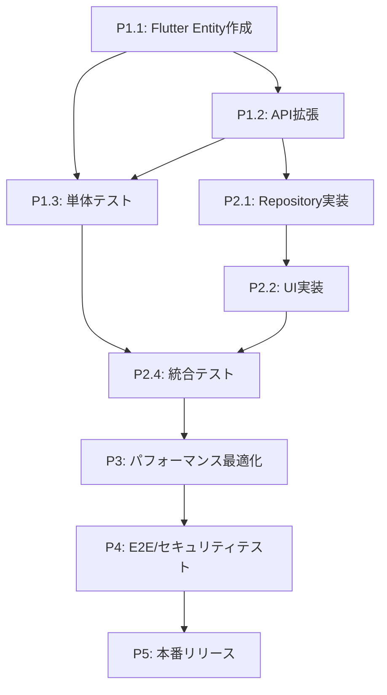

# 全年齢対応パーソナルカラー診断 - 実装タスク分解

## 概要

年齢・性別推定機能を含む全年齢対応パーソナルカラー診断システムの実装タスクを段階的に分解し、実装順序とマイルストーンを定義する。

## 実装フェーズ

### Phase 1: データ構造・基盤整備 (1-2週間)

#### P1.1 Flutter Client - ドメイン層拡張

**P1.1.1 新規エンティティ作成**
- [ ] `AgeGroup` enum作成 (`lib/features/diagnosis/domain/entities/age_group.dart`)
  - 5つの年代区分定義 (child, student, adult, middleAge, senior)
  - `displayName`, `apiValue` extension追加
  - `fromApiValue` static method追加
- [ ] `Gender` enum作成 (`lib/features/diagnosis/domain/entities/gender.dart`)
  - 3つの性別区分定義 (male, female, unknown)
  - `displayName`, `apiValue` extension追加
  - `fromApiValue` static method追加
- [ ] `PersonAnalysis` entity作成 (`lib/features/diagnosis/domain/entities/person_analysis.dart`)
  - `ageGroup`, `gender`, `confidence` フィールド
  - `fromJson`, `toJson` メソッド
  - Equatable実装

**P1.1.2 既存エンティティ拡張**
- [ ] `DiagnosisResult` entity拡張 (`lib/features/diagnosis/domain/entities/diagnosis_result.dart`)
  - `personAnalysis` フィールド追加 (Optional)
  - `hasPersonAnalysis` getter追加
  - `isAdaptiveContent` getter追加
  - `fromJson`, `toJson` 更新

**P1.1.3 Repository Interface拡張**
- [ ] `DiagnosisRepository` interface拡張 (`lib/features/diagnosis/domain/repositories/diagnosis_repository.dart`)
  - `diagnosePersonalColorEnhanced` メソッド追加

**P1.1.4 UseCase作成**
- [ ] `DiagnosePersonalColorEnhanced` usecase作成 (`lib/features/diagnosis/domain/usecases/diagnose_personal_color_enhanced.dart`)
  - `DiagnosePersonalColorParams` パラメータクラス作成
  - metadata対応

#### P1.2 Python Server - データ構造・API拡張

**P1.2.1 プロンプトエンジン拡張**
- [ ] `PersonalColorPrompt` class拡張 (`src/prompts/personal_color_analysis.py`)
  - `create_enhanced_analysis_prompt` メソッド追加
  - `get_adaptive_explanation_template` メソッド追加
  - `validate_enhanced_response_format` メソッド追加
  - 年代・性別別テンプレート定義

**P1.2.2 APIエンドポイント作成**
- [ ] 新API endpoint作成 (`src/api/endpoints/diagnosis.py`)
  - `/diagnose-enhanced` POST endpoint追加
  - `EnhancedDiagnosisResponse` レスポンスモデル作成
  - `PersonAnalysisResponse` サブモデル作成
  - リクエスト/レスポンス検証

**P1.2.3 GeminiService拡張**
- [ ] `GeminiService` class拡張 (`src/services/gemini_service.py`)
  - `analyze_personal_color_with_demographics` メソッド追加
  - `_parse_enhanced_response` メソッド追加
  - `_enhance_with_adaptive_content` メソッド追加
  - `_get_adaptive_tips` メソッド追加
  - エラーハンドリング・リトライロジック

#### P1.3 単体テスト作成

**P1.3.1 Flutter単体テスト**
- [ ] `PersonAnalysis` テスト (`test/features/diagnosis/domain/entities/person_analysis_test.dart`)
- [ ] `AgeGroup` extension テスト (`test/features/diagnosis/domain/entities/age_group_test.dart`)
- [ ] `Gender` extension テスト (`test/features/diagnosis/domain/entities/gender_test.dart`)
- [ ] `DiagnosisResult` 拡張テスト (`test/features/diagnosis/domain/entities/diagnosis_result_enhanced_test.dart`)
- [ ] `DiagnosePersonalColorEnhanced` usecase テスト

**P1.3.2 Python単体テスト**
- [ ] `PersonalColorPrompt` 拡張テスト (`tests/unit/prompts/test_personal_color_analysis_enhanced.py`)
- [ ] `GeminiService` 拡張テスト (`tests/unit/services/test_gemini_service_enhanced.py`)
- [ ] プロンプトテンプレート検証テスト

### Phase 2: UI実装・適応的コンテンツ (2-3週間)

#### P2.1 Flutter Client - データ層実装

**P2.1.1 Repository Implementation拡張**
- [ ] `DiagnosisRepositoryImpl` 拡張 (`lib/features/diagnosis/data/repositories/diagnosis_repository_impl.dart`)
  - `diagnosePersonalColorEnhanced` 実装
  - APIエンドポイント切り替えロジック
  - エラーハンドリング

**P2.1.2 Network Layer拡張**
- [ ] NetworkService 拡張 (`lib/core/network/network_service.dart`)
  - 新APIエンドポイント対応
  - レスポンス解析機能拡張

#### P2.2 Flutter Client - プレゼンテーション層実装

**P2.2.1 Provider/State管理拡張**
- [ ] `DiagnosisProvider` 拡張 (`lib/features/diagnosis/presentation/providers/diagnosis_provider.dart`)
  - 拡張診断機能追加
  - プライバシー設定状態管理
  - ローディング状態管理

**P2.2.2 診断結果画面拡張**
- [ ] `IosDiagnosisResultPage` 拡張 (`lib/features/diagnosis/presentation/ios/ios_diagnosis_result_page.dart`)
  - `_buildPersonAnalysisSection` メソッド追加
  - `_buildInfoChip` ヘルパーメソッド追加
  - プライバシー設定による表示制御
  - 適応的説明文の表示

**P2.2.3 設定画面作成**
- [ ] `PrivacySettingsPage` 作成 (`lib/features/settings/presentation/pages/privacy_settings_page.dart`)
  - 年代・性別情報表示スイッチ
  - プライバシー説明文
  - SharedPreferences連携
- [ ] 設定画面への遷移実装
  - メインメニューから設定画面へのナビゲーション
  - 設定アイコンの追加

#### P2.3 Server側 適応的コンテンツ実装

**P2.3.1 適応的説明文生成**
- [ ] 年代・性別別説明文テンプレート完成
  - 15パターンの組み合わせ (5年代 × 3性別)
  - 各パターンの語調・内容調整
  - フォールバック対応

**P2.3.2 適応的アドバイス生成**
- [ ] 年代・性別別アドバイス辞書作成
  - ライフスタイル別提案
  - 実用性重視/美的重視の使い分け
  - メイク・ファッション提案の深度調整

#### P2.4 統合テスト作成

**P2.4.1 API統合テスト**
- [ ] 拡張診断API統合テスト (`tests/integration/test_enhanced_diagnosis_api.py`)
- [ ] プロンプト・レスポンス統合テスト

**P2.4.2 Flutter統合テスト**
- [ ] Repository-UseCase統合テスト (`test/integration/enhanced_diagnosis_integration_test.dart`)
- [ ] プライバシー設定統合テスト

### Phase 3: パフォーマンス最適化・精度向上 (1-2週間)

#### P3.1 プロンプトエンジニアリング最適化

**P3.1.1 プロンプト精度向上**
- [ ] 年代推定精度向上 (目標70%以上)
  - プロンプト内容調整
  - 特徴説明の詳細化
  - サンプル画像でのA/Bテスト
- [ ] 性別推定精度向上 (目標80%以上)
  - 推定基準の明確化
  - 中性的特徴への対応強化
- [ ] パーソナルカラー精度維持 (目標85%以上)
  - 既存精度を維持しつつ拡張機能追加
  - 統合分析での精度検証

**P3.1.2 レスポンス形式最適化**
- [ ] JSON構造最適化
- [ ] エラーハンドリング強化
- [ ] フォールバック戦略改善

#### P3.2 パフォーマンステスト・最適化

**P3.2.1 応答時間最適化**
- [ ] レスポンス時間測定 (目標5秒以内)
- [ ] ボトルネック特定・改善
- [ ] 並行処理最適化

**P3.2.2 精度測定・改善**
- [ ] テストデータセット作成 (年代・性別ラベル付き)
- [ ] 精度測定自動化
- [ ] 精度向上のためのプロンプト調整

#### P3.3 パフォーマンステスト実装

**P3.3.1 Python パフォーマンステスト**
- [ ] レスポンス時間テスト (`tests/performance/test_enhanced_diagnosis_performance.py`)
- [ ] 並行処理テスト
- [ ] メモリ使用量テスト

**P3.3.2 精度テスト**
- [ ] 年代推定精度テスト (`tests/accuracy/test_demographic_estimation_accuracy.py`)
- [ ] 性別推定精度テスト
- [ ] パーソナルカラー精度維持テスト

### Phase 4: E2E・セキュリティテスト (1週間)

#### P4.1 E2Eテスト実装

**P4.1.1 Flutter E2Eテスト**
- [ ] 拡張診断フローE2Eテスト (`test/e2e/enhanced_diagnosis_e2e_test.dart`)
- [ ] プライバシー設定E2Eテスト
- [ ] エラーケースE2Eテスト

**P4.1.2 ユーザーシナリオテスト**
- [ ] 年代別ユーザージャーニーテスト
- [ ] プライバシー設定変更シナリオ
- [ ] エラーリカバリシナリオ

#### P4.2 セキュリティ・プライバシーテスト

**P4.2.1 プライバシー準拠テスト**
- [ ] データ保護テスト (`tests/security/test_privacy_compliance.py`)
- [ ] 具体的年齢非推定確認
- [ ] データ非永続化確認

**P4.2.2 セキュリティテスト**
- [ ] APIセキュリティヘッダーテスト
- [ ] XSS/インジェクション対策テスト (`test/security/data_validation_test.dart`)
- [ ] 入力値検証テスト

#### P4.3 ドキュメント整備

**P4.3.1 API仕様書作成**
- [ ] 拡張診断API仕様書
- [ ] OpenAPI/Swagger定義更新
- [ ] エラーコード一覧

**P4.3.2 運用ドキュメント**
- [ ] デプロイ手順書
- [ ] モニタリング設定
- [ ] トラブルシューティングガイド

### Phase 5: 本番リリース準備 (1-2週間)

#### P5.1 機能フラグ・段階的リリース準備

**P5.1.1 機能フラグ実装**
- [ ] Flutter側機能フラグ (`lib/core/config/feature_flags.dart`)
  - 拡張診断機能ON/OFF
  - プライバシー設定表示ON/OFF
- [ ] Server側機能フラグ
  - 拡張APIエンドポイント有効化
  - プロンプト切り替え機能

**P5.1.2 設定・環境管理**
- [ ] 環境別設定管理
  - Development/Staging/Production設定分離
  - API endpoint環境変数化
- [ ] ログ・モニタリング設定
  - 精度メトリクス収集
  - パフォーマンスメトリクス収集

#### P5.2 本番デプロイ・検証

**P5.2.1 ステージング環境検証**
- [ ] 全テストスイート実行
- [ ] 精度・パフォーマンス検証
- [ ] セキュリティ検証

**P5.2.2 本番デプロイ準備**
- [ ] デプロイメントスクリプト作成
- [ ] ロールバック手順作成
- [ ] モニタリング・アラート設定

**P5.2.3 A/Bテスト準備**
- [ ] A/Bテストフレームワーク準備
- [ ] メトリクス収集設定
- [ ] ユーザーフィードバック収集仕組み

## 実装優先度

### Critical Path (必須機能)
1. **データ構造拡張** (P1.1, P1.2): 基盤となる重要機能
2. **API統合** (P1.2.2, P2.1.1): サーバー・クライアント連携
3. **UI実装** (P2.2): ユーザー向け機能
4. **テスト実装** (P1.3, P2.4): 品質保証

### High Priority (重要機能)
1. **適応的コンテンツ生成** (P2.3): 主要機能価値
2. **プライバシー設定** (P2.2.3): GDPR準拠
3. **パフォーマンス最適化** (P3.2): ユーザビリティ

### Medium Priority (追加機能)
1. **精度向上** (P3.1): 品質向上
2. **E2Eテスト** (P4.1): 総合品質保証
3. **セキュリティテスト** (P4.2): セキュリティ強化

## リソース見積もり

### 開発工数見積もり (人日)

**Phase 1: データ構造・基盤整備** - 10-14人日
- Flutter Client: 6-8人日
- Python Server: 4-6人日

**Phase 2: UI実装・適応的コンテンツ** - 15-21人日
- Flutter Client: 10-14人日
- Python Server: 5-7人日

**Phase 3: パフォーマンス最適化・精度向上** - 7-14人日
- プロンプトエンジニアリング: 4-7人日
- テスト・検証: 3-7人日

**Phase 4: E2E・セキュリティテスト** - 5-7人日
- E2Eテスト: 3-4人日
- セキュリティテスト: 2-3人日

**Phase 5: 本番リリース準備** - 5-10人日
- 機能フラグ・設定: 2-4人日
- デプロイ・検証: 3-6人日

**総工数**: 42-66人日 (6-9週間、1人体制)

### 技術的依存関係



## リスク管理

### 技術リスク

**高リスク**
- **精度要件未達**: 年代推定70%、性別推定80%の精度確保
  - 対策: 段階的精度改善、プロンプト調整、テストデータ充実
- **パフォーマンス劣化**: 5秒以内応答時間の維持
  - 対策: 早期パフォーマンステスト、ボトルネック特定・改善

**中リスク**
- **Gemini API制限**: レート制限・利用制限への対応
  - 対策: リトライロジック、フォールバック機能、利用量監視
- **プライバシー要件**: GDPR準拠、データ保護要件
  - 対策: プライバシー設計レビュー、セキュリティテスト強化

**低リスク**
- **UI/UX複雑化**: 新機能追加による操作性悪化
  - 対策: ユーザビリティテスト、段階的リリース

### スケジュールリスク

**Phase 3 (パフォーマンス最適化)** に最大の不確実性
- 精度要件達成に時間がかかる可能性
- プロンプトエンジニアリングの反復作業

**緩和策**
- Phase 2完了時点で精度検証を実施
- 必要に応じてPhase 3に追加リソース投入
- 段階的精度改善によるリスク分散

## マイルストーン・成功基準

### Milestone 1: 基盤完成 (Phase 1完了時)
- [ ] 全新規エンティティ・API動作確認
- [ ] 基本的な年齢・性別推定機能動作
- [ ] 単体テスト90%以上Pass

### Milestone 2: 機能完成 (Phase 2完了時)
- [ ] 拡張診断フルフロー動作確認
- [ ] プライバシー設定機能動作
- [ ] 適応的コンテンツ生成確認
- [ ] 統合テスト95%以上Pass

### Milestone 3: 品質確認 (Phase 3完了時)
- [ ] 年代推定精度70%以上達成
- [ ] 性別推定精度80%以上達成
- [ ] レスポンス時間5秒以内達成
- [ ] パフォーマンステストPass

### Milestone 4: リリース準備完了 (Phase 4完了時)
- [ ] E2Eテスト100%Pass
- [ ] セキュリティテストPass
- [ ] ドキュメント整備完了

### Milestone 5: 本番リリース (Phase 5完了時)
- [ ] 段階的リリース実施
- [ ] モニタリング・メトリクス収集開始
- [ ] ユーザーフィードバック収集開始

## 品質ゲート

各Phaseで以下の品質ゲートをクリアしてから次Phase移行

### Phase 1 → Phase 2
- 新規エンティティの動作確認
- API基本動作確認
- 単体テスト90%以上Pass

### Phase 2 → Phase 3
- 拡張診断エンドツーエンド動作確認
- UI機能動作確認
- 統合テスト95%以上Pass

### Phase 3 → Phase 4
- 精度要件達成 (年代70%、性別80%)
- パフォーマンス要件達成 (5秒以内)
- パフォーマンステストPass

### Phase 4 → Phase 5
- E2EテストPass
- セキュリティ・プライバシーテストPass
- 運用ドキュメント整備完了

## CI/CD パイプライン

### 自動テスト戦略
```yaml
# 各PR・pushで実行
- Unit Tests (Flutter + Python)
- Integration Tests
- Lint/Format Check
- Security Scan

# 夜間実行
- Performance Tests
- E2E Tests
- Accuracy Tests

# Release時実行
- Full Test Suite
- Security Penetration Test
- Production Deployment
```

### デプロイ戦略
```
Development → Staging → Production
     ↓           ↓          ↓
   Unit Test  Integration  E2E Test
              Performance  Security
```

## 関連文書

- `requirements.md`: 機能要件定義
- `design.md`: 技術設計詳細
- `test_design.md`: テスト仕様
- `../initialize/tasks.md`: 既存システム実装タスク

## 更新履歴

| 日付 | バージョン | 変更内容 | 担当者 |
|------|------------|----------|--------|
| 2024-01-XX | 1.0 | 初版作成 | Claude |